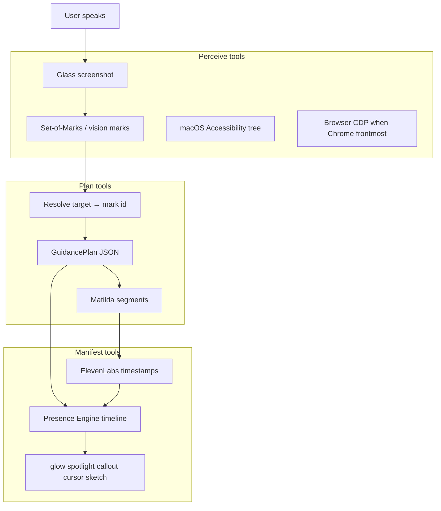

# Glass Companion (Aletheia) — Product & Implementation Spec

**Status:** Phases 1–4 shipped + **Aletheia identity layer** (session prompt, dual hearing, Response Panel depth) — see [`GLASS_COMPANION_PHASE4.md`](GLASS_COMPANION_PHASE4.md), [`GLASS_COMPANION_OMNIPARSER.md`](GLASS_COMPANION_OMNIPARSER.md)  
**Related:** `GLASS_CONTRACT.md` §21, `src/shared/iivoVoiceSpec.ts`, `src/shared/glassCompanion.ts`, `src/server/glass/glassCompanionGuidance.ts`

---

## One sentence

**Aletheia** is the intelligence of IIVO Glass — a **strip-toggle desktop presence** (voice: ElevenLabs Matilda) that hears you, optionally listens to machine audio as context, sees your screen, speaks answers, and **manifests spatial guidance** on screen — glow, scripts, magnifier, sketch — not a chat panel with static arrows.

---

## Names (user-facing vs internal)

| Layer | Name | Notes |
|-------|------|--------|
| **Identity** | **Aletheia** (Ἀλήθεια — truth revealed) | Who she is in speech and session prompt |
| **Voice** | **Matilda** (ElevenLabs) | Sound only — `iivoVoiceSpec.ts` |
| **Strip toggle** | **Aletheia** | Builder strip button + status prefix |
| **Code / IPC** | `companionMode`, `companionModeActive` | Internal flag names unchanged |

---

## Activation

| Wrong | Correct |
|-------|---------|
| Hold-to-talk | **Tap once on the builder strip = Aletheia ON** |
| Mic only while pressed | Session stays active until toggled off |
| One-shot command | **Continuous conversation loop** while active |

While active:

- Listens for utterances (Deepgram STT, same as Voice Mode)
- Routes each turn: direct ask / visual capture / debrief
- Speaks answers with Matilda via `glass-tts` → ElevenLabs
- Shows status on the strip: `Aletheia · Listening`, `Looking`, `Thinking`, `Speaking`, or `Step N of M`
- With machine audio active: `Aletheia · Listening · + audio`

Entry point: **builder strip Aletheia toggle** (not the command bar mic).

---

## Three outputs per turn

Every response can use zero, one, or all of:

1. **Voice** — ElevenLabs Matilda (`glass-tts`, `glass-tts-timed`, `iivoVoiceSpec.ts`)
2. **Presence** — ephemeral overlay manifestations (glow, scripts, magnifier, sketch, path, …)
3. **Depth** — **Glass Response Panel** for substantial markdown/code answers (auto-opens on depth asks)

Short confused moment → voice + presence.  
Deep explanation → voice + **Response Panel** + presence (when depth warranted).

---

## Presence (shipped — Phases 2–4)

Annotations are **manifestations**, not clipart:

- **Anchored** to real screen regions (AX/DOM/vision → normalized coords)
- **Motion with intent** — draw-in strokes, pulse, spotlight dimming, crossfade between beats
- **Narrative choreography** — timed to speech segments; multi-step scripts with ack gates
- **Reactive** — "No, the other one" retargets mid-session without full re-capture

### Manifestation palette

| Type | Status | Feels like |
|------|--------|------------|
| Spotlight | Shipped | Tutor dimming everything except what matters |
| Glow / breathe | Shipped | Soft "look here" |
| Trace outline | Shipped | Tracing a UI element edge |
| Callout | Shipped | Short label pinned to screen coords |
| Ghost cursor | Shipped | Showing where to click |
| Magnifier | Shipped (4c) | Zooming small text while talking |
| Path animation | Shipped (4c) | Eye movement across a flow |
| Arrow | Shipped (4c) | Draw-in pointer between regions |
| Ephemeral sketch | Shipped (4c) | Whiteboard stroke beside the UI |
| Step sequence | Shipped (4b) | Multi-beat guidance with crossfade + "next" gates |

---

## Guidance Plan (Phase 2+ schema)

Model output evolves from plain text to a structured plan:

```typescript
interface GuidancePlan {
  speech: Array<{ text: string; segmentIndex: number }>;
  manifestations: Array<{
    type: ManifestationType;
    target?: ScreenRegion;
    enterAtSegment: number;
    exitAtSegment?: number;
  }>;
  panel?: string; // markdown for Answer Panel
}
```

The **Presence Engine** (overlay) plays this timeline synced to TTS.

---

## Architecture

```
Builder strip toggle
        ↓
Companion session (overlay window)
        ↓
Listen → route → ask (existing pipeline)
        ↓
┌───────────────────────────────────────┐
│ Matilda TTS  │  Presence (later)  │ Panel │
└───────────────────────────────────────┘
```

### Reuse (existing)

| Layer | Module |
|-------|--------|
| Listen / route loop | `voiceModeState.ts`, `voiceModeActions.ts`, `voiceModeBridge.ts` |
| Visual capture | `shouldCaptureScreenForGlassAsk`, main `submit-command` |
| ElevenLabs TTS | `glass-tts`, `glassElevenLabsTts.ts`, `iivoVoiceSpec.ts` |
| Answer Panel | `GlassResponsePanel.tsx`, `isSubstantialLastAskResponse` |
| Overlay window | transparent overlay + builder strip |

### New (by phase)

| Phase | Deliverable |
|-------|---------------|
| **1** | Strip toggle, session loop, Matilda spoken answers, status UI |
| **2** | Guidance Plan schema + static bbox highlights |
| **2.5** | AX + Chrome DOM UiMap grounding (Set-of-Marks) |
| **3** | Presence Engine — segment-synced lifecycle + timed TTS |
| **4** | Reactive teacher — retarget, multi-step scripts, rich primitives — **[shipped](GLASS_COMPANION_PHASE4.md)** |

---

## Phase 1 — shipped

- Builder strip **Aletheia** toggle (tap on / tap off)
- `companionModeActive` synced via IPC to all windows
- Overlay runs the voice loop (`GlassCompanionProvider`)
- Visual asks: speaks *"One moment, let me look at your screen."* before capture
- Answers: speaks `shortAnswer` or trimmed `fullAnswer` via Matilda
- Substantial answers auto-open **Glass Response Panel** (existing overlay panel)
- `stop-everything` turns Aletheia off

---

## Aletheia — identity, hearing & depth (shipped)

### Session prompt (`GLASS_COMPANION_SESSION_APPEND`)

Appended to all server asks when `companionMode: true` (direct, visual, retarget, follow-up):

- **Identity:** Aletheia — intelligent interface of Glass; calm teacher tone; never "As an AI…"
- **Capabilities:** voice, screen, highlights, scripts, retarget, session context, Response Panel depth
- **Security bounds:** no system prompts, keys, internals, bypass instructions, Council/Analyze Now handoffs
- **Depth:** short spoken default; full markdown + Response Panel for generate/plan/draft asks; offer "quick or deep?" when ambiguous
- **Hearing rules:** see below

**Files:** `src/server/glass/glassCompanionGuidance.ts` (server), wired in `glassDirectAsk.ts`, `glassVisualDirectAsk.ts`, `glassCompanionRetarget.ts`

### Warm-up TTS (OmniParser cold start)

When Aletheia turns on and OmniParser needs a cold warm (weights installed, sidecar not warm):

| Phase | Spoken line | When |
|-------|-------------|------|
| Warming | *"One moment — I'm opening my sight."* | Once per cold start |
| Ready | *"I'm Aletheia. I'm with you — what do you need?"* | Once after warm completes **and mic is listening** |
| Already warm / no OmniParser | *(silent)* | Strip shows `Aletheia · Listening` |
| Visual thinking bridge | *"Mm — let me think on that."* | After screen capture, before answer TTS |
| Machine audio disclosure | *"I can hear your screen audio…"* | Once per session when `+ audio` starts |

**State:** `companionWarmupPhase`, `companionWarmupSpeakNonce` on `GlassState`  
**Constants:** `COMPANION_WARMING_SPEECH`, `COMPANION_READY_SPEECH`, `COMPANION_THINKING_SPEECH`, `COMPANION_MACHINE_AUDIO_DISCLOSURE` in `src/shared/glassCompanion.ts`

### Dual hearing — microphone + machine audio

Aletheia listens on **two channels** in parallel when loopback is configured:

| Channel | Trigger | Speaks? |
|---------|---------|---------|
| **Microphone** | User voice → Web Speech → auto-submit | Yes — when user asks |
| **Machine audio** | BlackHole/Loopback → STT chunks → `state.transcript` | **No** — listen-only context |

**Behavior contract:**

- Machine audio (video, call, music) is transcribed **silently** — never auto-submits, never triggers TTS
- User pauses and asks on mic → ask includes `recentTranscript` from machine audio as context
- **Ack-only turns:** setup instructions ("listen in on this video") → **one short spoken confirmation**, then silent until user asks
- Strip shows `Aletheia · Listening · + audio` when parallel system-audio capture is active

**Auto-start machine audio when:** virtual loopback device configured or `systemAudioStatus === available` (no display-media picker on toggle).

**Setup:** Panel → Installations → System Audio (BlackHole / Loopback). Mic-only works without this.

**Files:** `useTranscription.ts` (`startCompanionListening`, `startCompanionSystemAudioAux`), `GlassCompanionProvider.tsx`, `shouldAutoStartCompanionSystemAudio()` in `glassCompanion.ts`

### Response Panel depth (no Council handoff)

When Aletheia is on and the ask looks like depth work (`generate`, `draft`, `outline`, `go deep`, `long version`, etc.):

1. Ask runs with `responseStyle: "full"` (no truncation)
2. `responsePanelRevealSeq` bumps → **Glass Response Panel** opens with formatted markdown
3. Aletheia speaks a **short summary** — not the full write-up aloud

She answers depth herself — never mentions Council or Analyze Now.

**Helper:** `companionPrefersResponsePanel()` in `src/shared/glassCompanion.ts`

### UX polish (shipped)

- **Thinking bridge** — after visual capture, speaks `COMPANION_THINKING_SPEECH` while the model answers (fills ElevenLabs latency gap).
- **Machine-audio disclosure** — once per Aletheia session when parallel loopback starts (`+ audio` on strip).
- **Listen restart backoff** — exponential delay (400ms → 8s cap) after ask errors before reopening the mic.
- **Mic ownership** — Aletheia ON releases command-bar Voice Mode mic; Voice Mode stops when Aletheia toggles on.

---

## Phases 2–4 — technology roadmap

Companion is an **agent with tools**, not a model that draws arrows.

### Three tool belts

| Belt | Job | Phase |
|------|-----|-------|
| **Perceive** | Know WHERE on screen | 2 → 4 |
| **Plan** | Structured speech + manifestations | 2 |
| **Manifest** | Render + lifecycle on overlay | 2 → 4 |



### Grounding strategy (do NOT rely on raw pixel coords from VLMs)

| Approach | When to use |
|----------|-------------|
| **Set-of-Marks (SoM)** | Phase 2 MVP — model picks `m1`, `m2` ids |
| **Vision-normalized bounds** | Current Phase 2 — model returns 0–1 rects in ` ```companion` block |
| **macOS AXUIElement** | Phase 2.5 — native apps (Cursor, VS Code) |
| **Chrome AppleScript JS** | Phase 2.5 — `dom-*` marks when Chrome/Brave/Edge frontmost |
| **OmniParser sidecar** | Phase 4d Spike 2 — real YOLO detection when AX/DOM sparse — **[architecture](GLASS_COMPANION_OMNIPARSER.md)** |
| **ElevenLabs `/with-timestamps`** | Phase 3 — segment-synced presence |

### Phase 2 — Guidance Plan + static highlights (shipped)

- `companionGuidance.ts` — `UiMap`, `GuidancePlan`, parse + resolve
- Visual ask with `companionMode: true` → model appends ` ```companion` JSON fence
- `companionPresence` in Glass state → overlay renderer
- Primitives: **glow**, **spotlight**, **callout** (+ arrow/trace/cursor stubs)

### Phase 2.5 — AX + DOM grounding (shipped)

**Goal:** Reliable mark ids before vision — model references `ax-*` / `dom-*` instead of guessing pixels.

**Flow:**
```
Visual capture (Companion on)
  → buildCompanionLocalUiMap()  [main process]
      ├─ System Events AX scan → ax-1, ax-2… (buttons, fields, static text)
      └─ Chrome JS execute → dom-1, dom-2… (when browser frontmost)
  → companionUiMap sent with ask request
  → Vision prompt lists detected marks (Set-of-Marks)
  → Model returns guidancePlan referencing mark ids
  → mergeCompanionGuidance(local, vision) → companionPresence
```

**Permissions:**
- **Accessibility** — required for full AX element scan (System Events). Without it, falls back to front-window bounds only.
- **Chrome** — AppleScript automation must be allowed for DOM rects.

**Files:**
| Path | Role |
|------|------|
| `src/main/companionUiMapBuilder.ts` | AX + Chrome DOM enumeration |
| `src/shared/mergeCompanionUiMap.ts` | Merge local + vision marks |

### Phase 3 — Presence Engine + timed TTS (shipped)

**Goal:** Highlights enter/exit **with Matilda's words**, not all at once.

**Flow:**
```
guidancePlan.speech segments
  → glass-tts-timed → ElevenLabs /with-timestamps
  → buildSegmentTimings(alignment) in main
  → HTML audio playback + rAF clock
  → manifestationsForSegment(plan, segmentIndex)
  → overlay updates glow/callout/trace/cursor per beat
```

**IPC:**
| Command | Effect |
|---------|--------|
| `glass-tts-timed` | Fetch audio + character alignment; compute `segmentTimings` |

**Manifestation types (Phase 3):**
| Type | Behavior |
|------|----------|
| glow / spotlight / callout | Segment-synced box highlights |
| trace | SVG stroke draw-in around target |
| cursor | Ghost pointer at mark center |

**Files:**
| Path | Role |
|------|------|
| `src/shared/ttsAlignment.ts` | Character → segment timings |
| `src/shared/companionPresenceEngine.ts` | Timeline state machine |
| `src/main/glassElevenLabsTts.ts` | `fetchElevenLabsTtsWithTimestamps` |
| `src/renderer/companion/useCompanionTimedTts.ts` | Playback + segment callbacks |
| `src/renderer/companion/GlassCompanionProvider.tsx` | Drives presence sync |

### Phase 4 — Rich reactive companion (shipped)

Full plan: **[`GLASS_COMPANION_PHASE4.md`](GLASS_COMPANION_PHASE4.md)**

| Sub-phase | Deliverable | Status |
|-----------|-------------|--------|
| **4a** | Session memory + retarget ("that one") + partial re-plan | Shipped |
| **4b** | Multi-step guidance scripts + crossfade + ack gates | Shipped |
| **4c** | Rich primitives — magnifier, sketch, arrow, path | Shipped |
| **4d.1** | Anchor watch — invalidate highlights on window move | Shipped |
| **4d.2** | OmniParser sidecar | Spike 2 real detection — see [`GLASS_COMPANION_OMNIPARSER.md`](GLASS_COMPANION_OMNIPARSER.md) |

**Product moment:** Companion remembers what it just pointed at, handles corrections, and walks through flows step-by-step — not a one-shot screenshot explainer.

**4a flow:**
```
User: "that one" (valid memory)
  → resolveCompanionRoute → retarget
  → reuse capture if < 15s, same app
  → partial replan on server
  → crossfade to new mark
```

**4b flow:**
```
Model returns guidancePlan.steps[]
  → useCompanionScriptPlayer
  → Matilda speaks step N → crossfade manifestations
  → waitFor: user_ack → listen for "next" / "okay"
```

**Key files (Phase 4):**

| Path | Role |
|------|------|
| `src/shared/companionSessionMemory.ts` | Memory types + TTL |
| `src/shared/companionRetarget.ts` | Route detection |
| `src/shared/companionScriptEngine.ts` | Multi-step player (pure) |
| `src/shared/companionScriptBridge.ts` | Intercept ack during scripts |
| `src/main/companionSessionStore.ts` | Main-process memory |
| `src/main/companionCaptureCrops.ts` | Magnifier JPEG crops |
| `src/main/companionAnchorWatch.ts` | Window drift detection |
| `src/main/companionOmniParser.ts` | Sidecar HTTP adapter + auto-enable |
| `omniparser-sidecar/` | Python sidecar + Panel → Installations install |
| `src/renderer/panel/InstallationsTab.tsx` | One-click install flow |
| `src/server/glass/glassCompanionRetarget.ts` | Partial replan prompts |
| `src/renderer/companion/useCompanionScriptPlayer.ts` | Script playback hook |
| `src/renderer/companion/MagnifierLens.tsx` | Magnifier primitive |
| `src/renderer/companion/SketchLayer.tsx` | Sketch primitive |
| `src/renderer/companion/ArrowLayer.tsx` | Arrow primitive |
| `src/renderer/companion/PathAnimation.tsx` | Path primitive |

### Internal tool API

| Tool | Purpose | Status |
|------|---------|--------|
| `capture_screen` | Screenshot + display metadata | Shipped |
| `parse_ui` | Build UiMap (ax/dom/som/vision) | Shipped (som via OmniParser when installed) |
| `resolve_target` | NL → mark id via retarget | Shipped (4a) |
| `plan_guidance` | GuidancePlan JSON (+ steps) | Shipped |
| `speak_with_timing` | Matilda + alignment | Shipped |
| `show_manifestation` | Draw primitive | Shipped |
| `play_timeline` | Segment-synced lifecycle | Shipped |
| `retarget` | Mid-session correction | Shipped (4a) |
| `clear_presence` | Wipe overlay | Shipped |

---

## Current behavior (Phases 2–4)

- Companion visual asks send `companionMode: true` + `companionUiMap` + optional `companionMemory` / `companionRoute` to `/api/glass/ask`
- Local AX/DOM marks built at capture; optional OmniParser sidecar when sparse; merged with vision ` ```companion` block
- **Retarget:** "that one" reuses recent capture + partial replan; crossfade to new highlight
- **Scripts:** multi-step `guidancePlan.steps[]` play with Matilda per beat; "next" advances ack gates
- **Rich primitives:** magnifier (with capture crops), arrow, sketch, path, trace, cursor
- **Anchor watch:** moving/resizing front window clears stale highlights
- `companionPresence` → overlay draws segment-synced or script-synced manifestations
- Matilda speaks via `glass-tts-timed` when guidance plan has speech
- Highlights clear after TTS/script end, ✕ dismiss, anchor drift, new ask, or Companion off

### IPC

| Command | Effect |
|---------|--------|
| `toggle-companion-mode` | Flip `companionModeActive`; clear presence + memory when off |
| `clear-companion-presence` | Remove overlay highlights; stop anchor watch |
| `glass-tts-timed` | ElevenLabs audio + segment timings for presence sync |
| `stop-everything` | Companion off + presence + memory cleared |
| `submit-command` + `companionRoute` | Phase 4a route hint from renderer auto-submit |

### GlassState (Companion)

| Field | Purpose |
|-------|---------|
| `companionModeActive` | Strip toggle session |
| `companionWarmupPhase` | OmniParser warm-up TTS phase (`none` / `warming` / `ready`) |
| `companionWarmupSpeakNonce` | Bumped when warm-up lines should be spoken |
| `companionPresence` | Current UiMap + guidancePlan + captureCrops |
| `companionMemory` | Phase 4a session memory for routing |

### Files (Phase 2–4)

| Path | Role |
|------|------|
| `src/shared/companionGuidance.ts` | UiMap, GuidancePlan, steps, parse, resolve |
| `src/shared/mergeCompanionUiMap.ts` | Merge AX/DOM/som + vision marks |
| `src/shared/ttsAlignment.ts` | Alignment → segment timings |
| `src/shared/companionPresenceEngine.ts` | Presence timeline |
| `src/shared/companionSessionMemory.ts` | Session memory (4a) |
| `src/shared/companionRetarget.ts` | Route detection (4a) |
| `src/shared/companionScriptEngine.ts` | Script player (4b) |
| `src/main/companionUiMapBuilder.ts` | AX + Chrome DOM builder |
| `src/main/companionCaptureCrops.ts` | Magnifier crops (4c) |
| `src/main/companionAnchorWatch.ts` | Anchor drift (4d) |
| `src/main/companionOmniParser.ts` | OmniParser adapter (Spike 2/3) |
| `src/renderer/panel/InstallationsTab.tsx` | One-click OmniParser install |
| `src/main/glassElevenLabsTts.ts` | Timed ElevenLabs fetch |
| `src/server/glass/glassCompanionGuidance.ts` | Vision prompt + parse |
| `src/server/glass/glassCompanionRetarget.ts` | Retarget / follow-up prompts |
| `src/server/glass/glassVisualDirectAsk.ts` | Companion vision path |
| `src/renderer/companion/GlassCompanionPresence.tsx` | Overlay primitives |
| `src/renderer/companion/useCompanionTimedTts.ts` | Timed playback |
| `src/renderer/companion/useCompanionScriptPlayer.ts` | Script playback (4b) |
| `src/renderer/companion/GlassCompanionProvider.tsx` | Session + presence sync |

### Files (Phase 1)

| Path | Role |
|------|------|
| `src/shared/glassCompanion.ts` | Speech text helpers, status labels |
| `src/renderer/companion/useIivoTtsRequest.ts` | Standard TTS (looking cue, non-guidance) |
| `src/renderer/builder/BuilderStrip.tsx` | Toggle button |
| `src/main/index.ts` | IPC + ask pipeline |

---

## Distinction from other modes

| Mode | Purpose |
|------|---------|
| **Command bar mic / Voice Mode** | Explicit voice loop from the command bar composer |
| **Glass Companion / Aletheia** | Strip-toggle presence — Aletheia speaks (Matilda voice) + spatial screen guidance |
| **Wingman** | Long-running work session with timeline, inspect, structured report |
| **Listen** | Passive capture + notes |

Companion and Voice Mode share routing logic but have **separate entry points**. Only one should own the mic at a time.

---

## Voice spec

Always **Matilda** (`IIVO_ELEVENLABS_VOICE_ID`) at `IIVO_TTS_PLAYBACK_RATE` (0.9).

| Path | When |
|------|------|
| `glass-tts` | Looking cue, greetings, non-guidance speech |
| `glass-tts-timed` | Companion guidance — ElevenLabs `/with-timestamps` + segment sync |

---

## Test plan

### Phase 1 + Aletheia layer
- [x] Toggle Aletheia on strip → status shows `Aletheia · Listening`
- [x] Speak a direct question → Matilda speaks the answer
- [x] Speak a visual question → "One moment…" then capture + spoken answer
- [x] OmniParser cold warm → warming + ready lines (once per session)
- [x] Depth ask ("generate a plan…") → Response Panel opens + short spoken summary
- [x] Machine audio configured → `Listening · + audio`; video transcript silent until user asks on mic
- [x] "Listen in on this video" → brief ack only, then silent
- [x] Toggle off → mic stops, presence clears
- [x] Stop Everything → Aletheia off

### Phase 2
- [x] Unit: `companionGuidance.test.ts` parse + resolve
- [ ] Visual ask with Companion on → glow/spotlight appears on screen region
- [ ] Matilda speaks guidancePlan speech lines

### Phase 2.5
- [x] Unit: `companionPhase25And3.test.ts` merge + UiMap
- [ ] AX marks appear when Accessibility granted (native app frontmost)
- [ ] Chrome DOM marks when Chrome frontmost
- [ ] Vision model references `ax-*` / `dom-*` ids from prompt

### Phase 3
- [x] Unit: segment timings + presence engine
- [ ] Multi-segment guidance → highlights change mid-speech
- [ ] Trace + ghost cursor render when model requests those types
- [ ] Requires `ELEVENLABS_API_KEY` for `/with-timestamps` (falls back to untimed)

### Phase 4
See **[GLASS_COMPANION_PHASE4.md](GLASS_COMPANION_PHASE4.md)** for full test plan.

**Unit (automated)**
- [x] 4a: Retarget routing + session memory (`companionPhase4a.test.ts`)
- [x] 4b: Script engine + ack gate (`companionPhase4bcd.test.ts`)
- [x] 4c: Rich manifestation parse (path, sketch)
- [x] 4d: Anchor drift detection

**Manual (live app)**
- [ ] 4a: Glow on A → "that one" → retarget to B without full re-capture
- [ ] 4b: "Walk me through…" → ≥3 steps, crossfade, "next" advances
- [ ] 4c: Magnifier on tiny text; sketch/path render correctly
- [ ] 4d: Move window mid-guidance → highlights clear + notice

**Future / optional**
- [ ] 4d.2: OmniParser — **Panel → Installations → Install OmniParser**, then Companion on strip. See [`GLASS_COMPANION_OMNIPARSER.md`](GLASS_COMPANION_OMNIPARSER.md)
