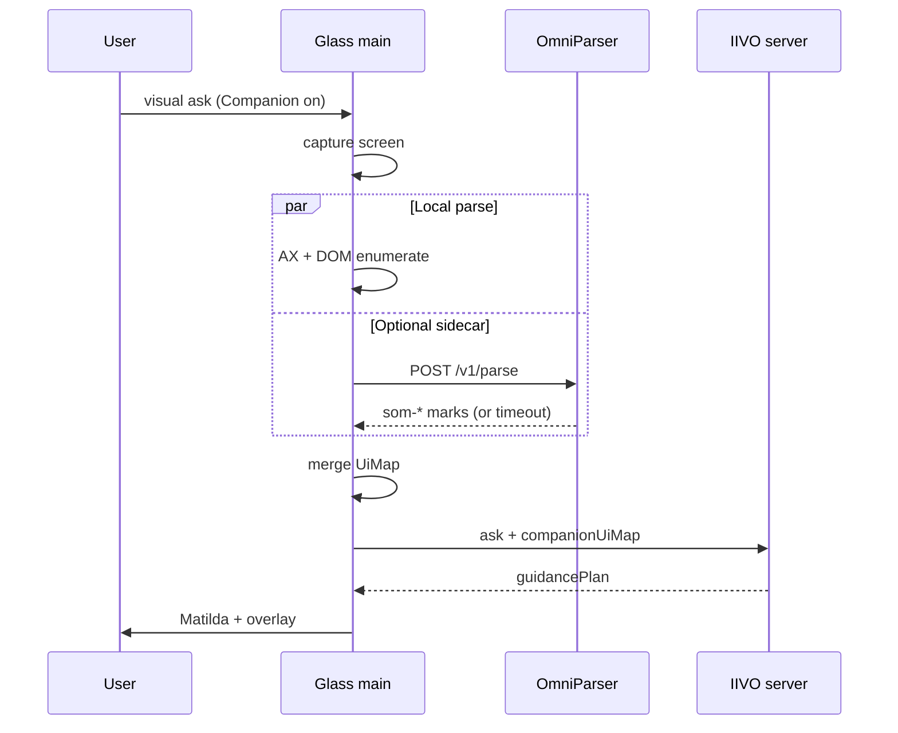

# Glass Companion — OmniParser Sidecar Architecture

**Status:** Spike 2 shipped (real YOLO detection + optional captions; mock fallback)  
**Parent:** [`GLASS_COMPANION.md`](GLASS_COMPANION.md) · [`GLASS_COMPANION_PHASE4.md`](GLASS_COMPANION_PHASE4.md)  
**Current code:** [`src/main/companionOmniParser.ts`](src/main/companionOmniParser.ts) · [`omniparser-sidecar/`](omniparser-sidecar/)

---

## One sentence

When Accessibility and Chrome DOM cannot enumerate enough UI regions, a **local sidecar process** runs a screen UI detector (e.g. OmniParser) on the capture image and returns **`som-*` marks** that Glass merges into the Companion UiMap before the vision model plans guidance.

---

## What this does (plain English)

Glass Companion needs a **map of clickable regions** on screen (buttons, fields, menus) so it can glow the right thing and say “click here.” It builds that map from:

1. **macOS Accessibility (AX)** — great for native controls  
2. **Chrome DOM** — great when Chrome is frontmost  
3. **Vision model** — understands the scene but pixel boxes can drift  

**OmniParser sidecar** is a fourth source: a small **local program** (separate from Glass) that looks at the **screenshot** and returns extra region boxes labeled `som-1`, `som-2`, etc.

**Spike 2 (current)** runs **real OmniParser v2 icon detection** (YOLO weights from Hugging Face). Optional Florence captions add labels like “Submit.” Without downloaded weights, the sidecar still returns mock marks (Spike 1) so dev isn’t blocked.

**When it runs:** only if you set `IIVO_COMPANION_OMNI_PARSER=1`, the sidecar is up, AX+DOM found **fewer than 3** marks, and the front app is **not Chrome**.

---

## For users vs developers

### Companion (strip toggle) — ready now

**You do not need terminals or the sidecar for Companion to work.** Click Companion on the strip — Glass listens and guides using Accessibility, Chrome DOM, and the vision model.

### OmniParser — optional, now streamlined

**Panel → Installations → Install OmniParser**

1. Click **Install OmniParser**
2. Panel closes, **Glass terminal** opens with instructions
3. Press **Enter** to confirm the download
4. When done, status shows **Installed — active with Companion**
5. Toggle Companion on the strip — detector starts automatically (no `.env` flags)

OmniParser **auto-enables** once weights are on disk. Disable with `IIVO_COMPANION_OMNI_PARSER=0` in `.env`.

| | Companion alone | + OmniParser (after Installations install) |
|--|-----------------|--------------------------------------------|
| User steps | Click Companion | Install once in Panel, then click Companion |
| Terminals | Never | Only during install (Glass terminal, Enter to confirm) |
| `.env` | Not needed | Not needed (auto when installed) |

---

## Try it later (copy-paste)

From the **repo root** (`ai-council-runner`). You need **two terminals** plus the IIVO server running as usual for Glass.

### One-time — download OmniParser weights

```bash
cd desktop-glass/omniparser-sidecar
chmod +x install-models.sh start.sh
./install-models.sh
```

First run installs PyTorch + ultralytics into `.venv` and downloads detection weights (~minutes). Optional captions: `./install-models.sh --caption` then `export IIVO_OMNIPARSER_CAPTION=1`.

### Terminal 1 — start the sidecar

```bash
cd desktop-glass/omniparser-sidecar
./start.sh
```

Leave this running. You should see `Mode: real detection (weights found; model loads in background)`.

**Wait ~20–30 seconds**, then verify the model is warm:

```bash
curl -s http://127.0.0.1:8765/health
# → {"ready":true,"modelLoaded":true,"mode":"yolo","device":"mps",...}
```

Or run the automated check (in another terminal):

```bash
cd desktop-glass/omniparser-sidecar
./verify.sh
```

### Terminal 2 — start Glass with the flag on

```bash
cd desktop-glass
export IIVO_COMPANION_OMNI_PARSER=1
export IIVO_OMNIPARSER_URL=http://127.0.0.1:8765
npm run dev
```

(If you normally start the IIVO server separately, do that too before using Companion.)

### What to do in the app

1. Turn on **Companion** mode in Glass.
2. Bring a **non-Chrome** app to the front where AX is sparse (e.g. Notes, Slack, a custom Electron app).
3. Ask a **visual** question (“what is this?”, “help me with this screen”).
4. Glass captures the screen, calls the sidecar, and merges `som-*` marks into the UiMap sent to the server.

### How you know it worked

- `curl /health` shows `"mode":"yolo"` and `"modelLoaded":true`.
- Sidecar terminal logs `POST /v1/parse` requests.
- Companion guidance references `som-*` ids aligned with **real** UI regions (not the fixed mock grid).
- If the sidecar is down or the flag is off, behavior is unchanged (AX/DOM/vision only).

### Optional: let Glass start the sidecar for you

When `IIVO_COMPANION_OMNI_PARSER=1` is set, Glass **auto-starts the sidecar when you turn Companion on** (strip toggle). You do not need a separate terminal.

Auto-spawn is on by default; disable with `IIVO_OMNIPARSER_SPAWN=0`.

### Turn it off

- Quit Glass, or `unset IIVO_COMPANION_OMNI_PARSER` before `npm run dev`.
- Stop the sidecar with Ctrl+C in Terminal 1.

---

## Problem

| Source | Works well | Fails on |
|--------|------------|----------|
| **AX (System Events)** | Native macOS controls | Canvas, custom Electron, sparse AX trees |
| **Chrome DOM** | Web pages in Chrome | Non-Chrome browsers, shadow DOM edge cases |
| **Vision model** | Semantic understanding | Unstable pixel boxes, mark id drift |
| **OmniParser (proposed)** | Dense interactive regions from pixels | Latency, model size, label quality |

OmniParser is **not** a replacement for AX/DOM or vision. It is a **fallback enricher** when local parsing returns fewer than three marks and the front app is not Chrome (where DOM is preferred).

---

## Design principles

1. **AX/DOM first** — sidecar runs only when `shouldTryOmniParser()` is true.
2. **Out of process** — ONNX inference never blocks Electron main for >50ms; sidecar owns the model.
3. **Budget ≤ 2s** on Apple Silicon — parallel with vision ask if possible; timeout → empty marks.
4. **Same mark schema** — output is normal `UiMark` with `source: "som"`.
5. **Feature-flagged** — off by default until spike proves value.

---

## High-level architecture

```mermaid
flowchart TB
  subgraph glass [IIVO Glass — Electron main]
    Capture[Visual capture]
    AXDOM[companionUiMapBuilder\nAX + Chrome DOM]
    Gate{shouldTryOmniParser?\nmarks < 3, not Chrome}
    Adapter[companionOmniParser.ts]
    Merge[mergeCompanionUiMap]
    Ask[/api/glass/ask\ncompanionMode + companionUiMap]
  end

  subgraph sidecar [OmniParser sidecar — separate process]
    HTTP[HTTP POST /parse]
    Pre[Resize / normalize image]
    ONNX[OmniParser v2 ONNX]
    Post[Filter + NMS + label]
  end

  Capture --> AXDOM
  AXDOM --> Gate
  Gate -->|yes| Adapter
  Gate -->|no| Merge
  Adapter -->|JPEG base64| HTTP
  HTTP --> Pre --> ONNX --> Post
  Post -->|som marks JSON| Adapter
  Adapter --> Merge
  Merge --> Ask
```

---

## Process model

### Option A — Local HTTP sidecar (recommended)

| Property | Value |
|----------|-------|
| **Process** | Python (`uvicorn`) or Node worker spawned by Glass on first use |
| **Bind** | `127.0.0.1:PORT` (ephemeral port written to `~/.iivo/omniparser.port` or env) |
| **Lifecycle** | Start on first companion visual capture when flag on; idle timeout 5 min |
| **Packaging** | Optional download bundle (~200–500 MB model); not in core Glass DMG v1 |

**Why HTTP on localhost:** simple to debug with `curl`, language-agnostic (Python fits OmniParser ecosystem), easy to kill/restart without crashing Glass.

### Option B — Unix socket / stdio (future)

Lower overhead for high-frequency calls. Defer until Option A is stable.

---

## API contract

### `POST /v1/parse`

**Request**

```json
{
  "imageBase64": "<JPEG data, no data: prefix>",
  "width": 1920,
  "height": 1080,
  "maxMarks": 24,
  "minConfidence": 0.15
}
```

**Response**

```json
{
  "marks": [
    {
      "id": "som-1",
      "label": "Submit",
      "bounds": { "x": 0.72, "y": 0.88, "w": 0.08, "h": 0.04 },
      "confidence": 0.91
    }
  ],
  "latencyMs": 840,
  "modelVersion": "omniparser-v2.0"
}
```

**Errors**

| Code | Meaning | Glass behavior |
|------|---------|----------------|
| `503` | Model not loaded | Log once; return `[]` |
| `408` | Timeout (>2s) | Return `[]`; vision-only fallback |
| `400` | Bad image | Return `[]` |

### Health

`GET /health` → `{ "ready": true, "modelLoaded": true }`

Glass calls health once at sidecar start before enabling parse.

---

## Mark id convention

| Prefix | Source |
|--------|--------|
| `ax-*` | macOS Accessibility |
| `dom-*` | Chrome AppleScript |
| `som-*` | OmniParser sidecar |
| `m1`, `m2`… | Vision model (fallback) |

Sidecar assigns `som-1` … `som-N` in reading order (top-to-bottom, left-to-right) after NMS.

Merge priority (existing): **ax > dom > som > vision** when regions overlap.

---

## Glass integration (current + planned)

### Today (Spike 1)

```bash
# Terminal 1 — mock sidecar
cd desktop-glass/omniparser-sidecar && ./start.sh

# Terminal 2 — Glass
export IIVO_COMPANION_OMNI_PARSER=1
export IIVO_OMNIPARSER_URL=http://127.0.0.1:8765
npm run dev
```

```typescript
// src/main/companionOmniParser.ts
shouldTryOmniParser(axDomMarkCount, appName)
tryOmniParserMarks({ imageDataUrl, captureWidth, captureHeight }) // POST /v1/parse
ensureOmniParserSidecar() // health check; optional spawn when IIVO_OMNIPARSER_SPAWN=1
```

Wired in `index.ts` after `buildCompanionLocalUiMap()` on companion visual captures.

### Implemented (Spike 1)

See [`companionOmniParser.ts`](src/main/companionOmniParser.ts): `ensureOmniParserSidecar()`, `tryOmniParserMarks()`, 2s timeout, optional spawn via `IIVO_OMNIPARSER_SPAWN=1`.

---

## Sidecar implementation sketch (Python)

```
omniparser-sidecar/
├── pyproject.toml
├── server.py          # FastAPI: /health, /v1/parse
├── parser.py          # Load ONNX, run inference
├── models/            # Downloaded on first run (not in git)
│   └── omniparser-v2.onnx
└── README.md
```

**`server.py` flow**

1. Load model at startup (warm — first request must not pay cold load).
2. Accept base64 JPEG → decode → RGB tensor.
3. Run OmniParser → boxes + labels + scores.
4. NMS + filter by `minConfidence`.
5. Convert pixel boxes → normalized 0–1 bounds relative to input dimensions.
6. Return JSON marks.

**Resource budget (target)**

| Metric | Target |
|--------|--------|
| Cold start | < 5s (model load once) |
| Warm parse (M1/M2, 1920×1080 JPEG) | < 1.5s p95 |
| RAM | < 2 GB resident |
| Disk | Model bundle optional install |

---

## Timing in the visual ask pipeline



**Optimization:** Start sidecar request **in parallel** with AX/DOM scan (both need the same capture). Wait max 2s for sidecar before proceeding to server ask.

---

## Environment variables

| Variable | Default | Purpose |
|----------|---------|---------|
| `IIVO_COMPANION_OMNI_PARSER` | off | Master enable (`1` = on) |
| `IIVO_OMNIPARSER_URL` | `http://127.0.0.1:8765` | Sidecar base URL |
| `IIVO_OMNIPARSER_SPAWN` | on when OmniParser enabled | Set `0` to disable auto-start |
| `IIVO_OMNIPARSER_SPAWN_WAIT_MS` | `45000` | Wait for sidecar + model load |
| `IIVO_OMNIPARSER_WAIT_MODEL` | on | Set `0` to skip model warm-up wait |
| `IIVO_OMNIPARSER_TIMEOUT_MS` | `4000` | Parse deadline (warm ~1.4s) |
| `IIVO_OMNIPARSER_MIN_CONFIDENCE` | `0.15` | Detection confidence threshold |
| `IIVO_OMNIPARSER_MIN_MARKS` | `3` | Skip sidecar if AX+DOM ≥ this (Glass gate) |

---

## Failure modes

| Scenario | Behavior |
|----------|----------|
| Sidecar not installed | Gate off or spawn fails → AX/DOM + vision only |
| Parse timeout | Log warning; proceed without som marks |
| Low-confidence detections | Filtered server-side; may return 0 marks |
| Overlap with ax/dom mark | som mark dropped in merge (lower rank) |
| User on Chrome with good DOM | Sidecar **skipped** intentionally |

---

## Security

- Bind **127.0.0.1 only** — no LAN exposure.
- Accept images only from Glass main (no auth token needed on localhost; optional shared secret for defense in depth).
- Do not persist screenshots to disk in sidecar (in-memory only).
- Sidecar runs with user permissions — same trust model as Glass.

---

## Implementation phases

| Phase | Deliverable |
|-------|-------------|
| **Spike 0** (done) | `companionOmniParser.ts` stub + gate + merge hook |
| **Spike 1** (done) | Python FastAPI mock sidecar + Glass HTTP adapter |
| **Spike 2** (done) | Real OmniParser v2 YOLO detection + optional Florence captions |
| **Spike 3** (partial) | Installations panel tab + auto-enable when weights present + terminal install flow |
| **Prod** | Ship behind flag; measure mark count uplift + latency in telemetry |

---

## Success criteria (sidecar v1)

- [ ] Adds ≥3 som marks on at least one “hard” app where AX returns 0–2 marks
- [ ] p95 parse latency < 2s on M1/M2 at 1080p JPEG
- [ ] Vision model references som ids in companion JSON when present
- [ ] No Glass main-thread blocking > 50ms (all IO async)
- [ ] Sidecar crash does not crash Glass

---

## Related files

| Path | Role |
|------|------|
| `src/main/companionOmniParser.ts` | Glass adapter (HTTP + optional spawn) |
| `omniparser-sidecar/` | Python sidecar (`./install-models.sh` then `./start.sh`) |
| `src/main/companionUiMapBuilder.ts` | AX + DOM marks |
| `src/shared/mergeCompanionUiMap.ts` | Merge som with ax/dom/vision |
| `src/main/index.ts` | Calls tryOmniParserMarks on capture |
| `src/server/glass/glassCompanionGuidance.ts` | Lists marks in vision prompt |

---

## References

- [Microsoft OmniParser](https://github.com/microsoft/OmniParser) — screen parsing research / models
- Phase 4d plan: [`GLASS_COMPANION_PHASE4.md`](GLASS_COMPANION_PHASE4.md) §4d.2
