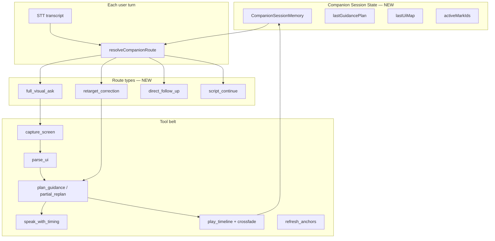

# Glass Companion — Phase 4 Plan

**Status:** Shipped (4a–4c, 4d.1) · OmniParser sidecar Spike 2 (real detection) — see [`GLASS_COMPANION_OMNIPARSER.md`](GLASS_COMPANION_OMNIPARSER.md)  
**Parent spec:** [`GLASS_COMPANION.md`](GLASS_COMPANION.md)  
**Prerequisite:** Phases 1–3 shipped (toggle session, Guidance Plan, AX/DOM grounding, segment-synced presence)

---

## One sentence

Phase 4 turns Companion from a **single-turn screen explainer** into a **reactive teacher** — it remembers what it just pointed at, handles corrections mid-session, runs multi-step guidance scripts, and renders richer presence (magnifier, sketch, path) without feeling like clipart.

---

## What Phase 4 is NOT

| Not this | Why |
|----------|-----|
| Wingman replacement | Wingman = long work session, timeline, git diff, structured report. Companion = live voice + ephemeral overlay guidance. |
| Autonomous background scanning | No always-on proactive loop (that's Wingman §future). Companion reacts to **user turns** while toggled on. |
| Permanent screen markup | All manifestations remain **ephemeral** — cleared when the beat ends or the user dismisses. |
| Hold-to-talk | Still **toggle-on session** from the builder strip. |

---

## Foundation (Phases 1–3 recap)

What Phase 4 builds on:

```
Toggle ON → listen loop → visual ask (companionMode)
  → buildCompanionLocalUiMap (ax/dom)
  → vision + ```companion``` JSON
  → mergeCompanionGuidance → companionPresence
  → glass-tts-timed → segment-synced overlay
```

**Gaps Phase 4 closes:**

| Gap today | Phase 4 fix |
|-----------|-------------|
| Each turn is isolated — no memory of last marks | **Session context** — prior UiMap, last target mark, last plan |
| "No, the other one" starts a full new ask | **Retarget** — partial re-plan on existing capture or fast re-capture |
| One GuidancePlan per turn | **Multi-step scripts** — chained beats within one teaching moment |
| magnifier / sketch / path / arrow types exist in schema but not rendered | **Rich primitives** — full renderer + model prompt support |
| Marks drift if user scrolls/moves window | **Anchor refresh** (optional) — re-ground or invalidate |
| AX/DOM only via AppleScript | **Optional OmniParser** — local UI detector for harder apps — **[sidecar design](GLASS_COMPANION_OMNIPARSER.md)** |

---

## Phase 4 product moments

These are the experiences Phase 4 must enable:

### 1. Correction without restart
> User: "What's this error?"  
> Matilda: glow on line 42 + explains  
> User: "No, the one below it"  
> Matilda: **crossfade** to line 43 — no full "one moment, looking…" unless screen changed

### 2. Multi-step teaching
> User: "Walk me through submitting this form"  
> Matilda:  
> - Beat 1: spotlight name field + "Start here"  
> - Beat 2: crossfade to email field + "Then your email"  
> - Beat 3: ghost cursor on Submit + "Finally, click here"

### 3. Ephemeral sketch
> User: "Draw how this should connect"  
> Matilda: floating SVG sketch **beside** the UI (not pretending to be native) + voice explaining — clears when done

### 4. Magnifier on small text
> Terminal error in 9px font  
> Matilda: magnifier lens over region + reads the line aloud

---

## Architecture (Phase 4)



---

## Sub-phases (recommended build order)

Phase 4 is large; ship in four sub-phases so each is reviewable and testable.

### 4a — Session memory + retarget routing ✅

**Goal:** Companion remembers the last guidance beat and handles corrections.

**Deliverables:**

1. **`CompanionSessionMemory`** (main + shared types)
   - `lastPrompt`, `lastUiMap`, `lastGuidancePlan`, `lastCaptureId`, `lastCaptureAt`
   - `activeMarkIds[]` — marks highlighted in the last beat
   - TTL: invalidate if capture older than ~30s or frontmost app changed

2. **`resolveCompanionRoute(transcript, memory)`** — pure router
   ```typescript
   type CompanionRoute =
     | "full_visual_ask"      // default visual path
     | "retarget"             // "that one", "the other", "no not that"
     | "direct_follow_up"     // no new capture — text-only clarify
     | "script_continue";     // "okay", "next", "go on"
   ```

3. **Retarget patterns** (extend `glassVisualIntent` or new `companionRetarget.ts`)
   - "that one", "the other one", "no the button below", "not that", "this one instead"

4. **Partial re-plan API** — server endpoint or prompt mode
   - Input: prior UiMap + prior plan + correction utterance
   - Output: **patch plan** — new `targetMarkId` + 1–2 speech segments, not full re-answer
   - Skip capture if `lastCaptureAt` < 5s and same app/window title

5. **IPC:** `companion-retarget` optional; or fold into existing `submit-command` with `companionMode` + memory payload

**Files (planned):**
| Path | Role |
|------|------|
| `src/shared/companionSessionMemory.ts` | Memory types + TTL helpers |
| `src/shared/companionRetarget.ts` | Route detection + retarget patterns |
| `src/main/companionSessionStore.ts` | Main-process session memory |
| `src/server/glass/glassCompanionRetarget.ts` | Partial re-plan prompt |

**Test:** Unit tests for route detection; manual "that one" after initial glow.

---

### 4b — Multi-step guidance scripts ✅

**Goal:** One teaching moment = multiple beats with crossfade, not one blob.

**Schema extension:**

```typescript
interface GuidancePlan {
  captureId: string;
  /** Phase 4 — optional multi-beat script (overrides flat speech[] when present). */
  steps?: GuidanceStep[];
  speech: GuidanceSpeechSegment[];
  manifestations: GuidanceManifestation[];
  panel?: string;
}

interface GuidanceStep {
  stepIndex: number;
  speech: GuidanceSpeechSegment[];  // segments for this beat only
  manifestations: GuidanceManifestation[];
  /** Phase 4a — wait before next beat. */
  waitFor?: "speech_end" | "user_ack";
  /** Transition to next step. */
  transition?: "crossfade" | "clear" | "hold";
}
```

**Presence Engine v2:**
- Play step 0 → on `speech_end` → crossfade manifestations → step 1
- `waitFor: "user_ack"` — listen for "okay" / "next" before advancing (reuse voice loop, don't submit full ask)
- Strip status: `Companion · Step 2 of 4`

**Model prompt:** Ask for `steps[]` when user says "walk me through", "step by step", "show me how to…"

**Files (planned):**
| Path | Role |
|------|------|
| `src/shared/companionGuidance.ts` | Extend schema + parsers |
| `src/shared/companionScriptEngine.ts` | Step player (pure) |
| `src/renderer/companion/useCompanionScriptPlayer.ts` | Overlay hook |
| `src/renderer/companion/GlassCompanionPresence.css` | Crossfade transitions |

**Test:** 3-step mock plan plays with crossfade; ack gate advances on "next".

---

### 4c — Rich manifestation primitives ✅

**Goal:** Types already in schema become real on screen.

| Type | Renderer | Notes |
|------|----------|-------|
| **arrow** | SVG line from previous mark or screen edge → target | Animated draw-in |
| **magnifier** | Canvas crop of last capture in circular lens | Requires `captureThumbnail` in presence payload |
| **sketch** | Floating SVG `path` or `polyline` in overlay space | Model returns `sketchPaths[]` — not tied to a mark |
| **path** | Animated dot moving A → B across marks | Eye-movement between two `targetMarkId`s |

**Schema extension:**

```typescript
interface GuidanceManifestation {
  type: ManifestationType;
  targetMarkId?: string;       // optional for sketch
  enterAtSegment: number;
  exitAtSegment?: number;
  label?: string;
  /** sketch / path only */
  sketchPaths?: string[];      // SVG path d strings, normalized 0–1
  pathFromMarkId?: string;
  pathToMarkId?: string;
}
```

**Capture thumbnail for magnifier:**
- Store small base64 crop of targeted region in `companionPresence.captureCrops[markId]` (main, at merge time)
- Or re-crop from last `imageDataUrl` in renderer (prefer main — already has capture)

**Files (planned):**
| Path | Role |
|------|------|
| `src/renderer/companion/MagnifierLens.tsx` | Lens component |
| `src/renderer/companion/SketchLayer.tsx` | Ephemeral whiteboard |
| `src/renderer/companion/PathAnimation.tsx` | A→B motion |
| `src/main/companionCaptureCrops.ts` | Crop regions from last capture |

---

### 4d — Anchor refresh + optional OmniParser

**4d.1 Anchor refresh ✅** — Option A shipped: poll window bounds; invalidate presence on drift.

**4d.2 OmniParser ✅ Spike 2** — Real YOLO detection sidecar + Glass adapter. Run `./install-models.sh` then `./start.sh`. Full design: **[`GLASS_COMPANION_OMNIPARSER.md`](GLASS_COMPANION_OMNIPARSER.md)**.

**Files (planned):**
| Path | Role |
|------|------|
| `src/main/companionAnchorWatch.ts` | Poll window bounds during active presence |
| `src/main/companionOmniParser.ts` | Optional local parser adapter (feature flag) |

---

## Tool API (Phase 4 completion)

Map internal tools to implementation status:

| Tool | Phase | 4a | 4b | 4c | 4d |
|------|-------|----|----|----|-----|
| `capture_screen` | 1–2 | ✓ | | | refresh |
| `parse_ui` | 2.5 | ✓ | | | OmniParser |
| `resolve_target` | — | **retarget** | | | |
| `plan_guidance` | 2 | ✓ | **steps[]** | **sketch paths** | |
| `speak_with_timing` | 3 | ✓ | per-step | | |
| `show_manifestation` | 2–3 | ✓ | crossfade | **rich types** | |
| `play_timeline` | 3 | ✓ | **script engine** | | |
| `retarget` | — | **NEW** | | | |
| `clear_presence` | 2 | ✓ | | | |

---

## Server / model strategy

| Task | Model | Latency budget |
|------|-------|----------------|
| Full visual guidance | Vision (Sonnet) | 3–8s |
| Retarget correction | Text-only (Haiku) + prior UiMap JSON | < 1.5s |
| Direct follow-up | Direct ask (Haiku/Sonnet) | 1–3s |
| Multi-step script | Vision (Sonnet) — ask for `steps[]` | 4–10s |

**New server routes (planned):**
| Route | Purpose |
|-------|---------|
| `POST /api/glass/companion/replan` | Partial plan patch given memory + utterance |
| Extend `/api/glass/ask` | Accept `companionMemory` + `companionRoute` |

**Prompt modes:**
- `companionMode: true` — existing full guidance
- `companionRetarget: true` — small JSON patch only, no markdown essay
- `companionScript: true` — require `steps[]` in companion fence

---

## IPC additions (planned)

| Command / state | Effect |
|-----------------|--------|
| `companion-session-memory` | Read/write session memory (or fold into GlassState) |
| `companion-advance-step` | User said "next" — advance script (renderer → main) |
| `companion-presence-crossfade` | Optional — or handle entirely in renderer |
| `GlassState.companionMemory` | Synced memory for overlay + panel debug |

---

## UX / strip status labels (Phase 4)

| State | Strip label |
|-------|-------------|
| Retargeting | `Companion · Retargeting…` |
| Multi-step | `Companion · Step 2 of 4` |
| Waiting for ack | `Companion · Ready when you are` |
| Anchor lost | `Companion · Screen moved` |

---

## Risks and mitigations

| Risk | Mitigation |
|------|------------|
| Retarget without capture picks wrong mark | Constrain to marks in last UiMap; ask clarifying TTS if ambiguous |
| Multi-step scripts feel slow | Pre-fetch TTS for step 1 while showing step 0; stream later steps |
| OmniParser latency | Feature flag; AX/DOM first |
| Sketch paths from model are garbage | Validate SVG path syntax; fallback to callout-only |
| Memory stale after app switch | Invalidate on `activeApp` change (already tracked in GlassState) |
| ElevenLabs cost on multi-step | Cap steps at 5; truncate speech per step |

---

## Success criteria (Phase 4)

**Shipped in code**
- [x] Session memory + retarget routing (`companionSessionMemory`, `companionRetarget`)
- [x] Multi-step `steps[]` schema + script player + ack bridge
- [x] Magnifier, sketch, arrow, path renderers + capture crops
- [x] Anchor watch invalidates on window move
- [x] Unit tests: `companionPhase4a.test.ts`, `companionPhase4bcd.test.ts`

**Manual QA (still open)**
- [ ] "That one" retargets without full re-ask when capture < 30s old
- [ ] "Walk me through this" produces ≥3 step script with crossfade
- [ ] Magnifier on small-text targets in live app
- [ ] Sketch layer clears on beat end

**Future**
- [ ] OmniParser sidecar v1 — see [`GLASS_COMPANION_OMNIPARSER.md`](GLASS_COMPANION_OMNIPARSER.md)

**Docs**
- [x] `GLASS_COMPANION.md` updated Phases 1–4
- [x] `GLASS_CONTRACT.md` §21 Companion

---

## Implementation order (completed)

```
Sprint 1 (4a)  ✅ Session memory + retarget route + partial replan
Sprint 2 (4b)  ✅ GuidanceStep schema + script player + crossfade
Sprint 3 (4c)  ✅ arrow, magnifier, sketch, path renderers
Sprint 4 (4d)  ✅ Anchor watch · ⏳ OmniParser stub (sidecar TBD)
```

---

## Files touched (as built)

| Area | New files | Modified files |
|------|-----------|----------------|
| Shared | `companionSessionMemory.ts`, `companionRetarget.ts`, `companionScriptEngine.ts`, `companionScriptBridge.ts`, `companionScriptPatterns.ts`, `companionActions.ts` | `companionGuidance.ts`, `glassCompanion.ts`, `glassAskTypes.ts`, `ipc.ts` |
| Main | `companionSessionStore.ts`, `companionAnchorWatch.ts`, `companionCaptureCrops.ts`, `companionOmniParser.ts` | `index.ts`, `companionUiMapBuilder.ts` |
| Server | `glassCompanionRetarget.ts` | `glassCompanionGuidance.ts`, `glassVisualDirectAsk.ts`, `glassAskHandler.ts`, `glassAskTypes.ts`, `glassDirectAsk.ts` |
| Renderer | `useCompanionScriptPlayer.ts`, `MagnifierLens.tsx`, `SketchLayer.tsx`, `ArrowLayer.tsx`, `PathAnimation.tsx` | `GlassCompanionProvider.tsx`, `GlassCompanionPresence.tsx`, `GlassCompanionPresence.css` |
| Tests | `companionPhase4a.test.ts`, `companionPhase4bcd.test.ts` | `package.json` test script |
| Docs | `GLASS_COMPANION_OMNIPARSER.md` | `GLASS_COMPANION.md`, `GLASS_COMPANION_PHASE4.md` |

---

## Test plan (Phase 4)

### 4a — Retarget
- [x] Unit: retarget intent detection
- [x] Unit: memory invalidates when `activeApp` changes
- [ ] Manual: glow on button A → "that one" points to B without new capture

### 4b — Scripts
- [x] Unit: 3-step plan advances on `speech_end`
- [x] Unit: `waitFor: user_ack` blocks until ack phrase
- [ ] Manual: form walkthrough crossfades fields

### 4c — Rich primitives
- [x] Unit: path + sketch manifestation parse
- [ ] Manual: magnifier on terminal error line
- [ ] Manual: arrow draws between two marks

### 4d — Anchor / parser
- [x] Unit: anchor drift detection
- [ ] Manual: move window mid-guidance → invalidate + notice
- [ ] OmniParser sidecar adds marks when AX empty — see [`GLASS_COMPANION_OMNIPARSER.md`](GLASS_COMPANION_OMNIPARSER.md)

---

## Decisions (resolved during implementation)

1. **Retarget capture policy** — Skip capture if same app + < 15s; else full re-capture. ✅
2. **User ack phrases** — Fixed list ("next", "okay", "go on") via `companionScriptBridge`. ✅
3. **Sketch coordinate space** — Normalized 0–1 viewport (`viewBox="0 0 1 1"`). ✅
4. **OmniParser in 4d?** — Anchor invalidate shipped first; parser = stub + [`GLASS_COMPANION_OMNIPARSER.md`](GLASS_COMPANION_OMNIPARSER.md). ✅

5. **Answer Panel during multi-step?** — Last step only if `panel` present (recommended; not enforced in code yet).

---

## Related docs

- [`GLASS_COMPANION.md`](GLASS_COMPANION.md) — master spec Phases 1–4
- [`GLASS_COMPANION_OMNIPARSER.md`](GLASS_COMPANION_OMNIPARSER.md) — OmniParser sidecar architecture (4d.2)
- [`GLASS_VISION.md`](GLASS_VISION.md) — #157 multi-window context, AX reader
- [`GLASS_CONTRACT.md`](GLASS_CONTRACT.md) — §19 Glass Companion
