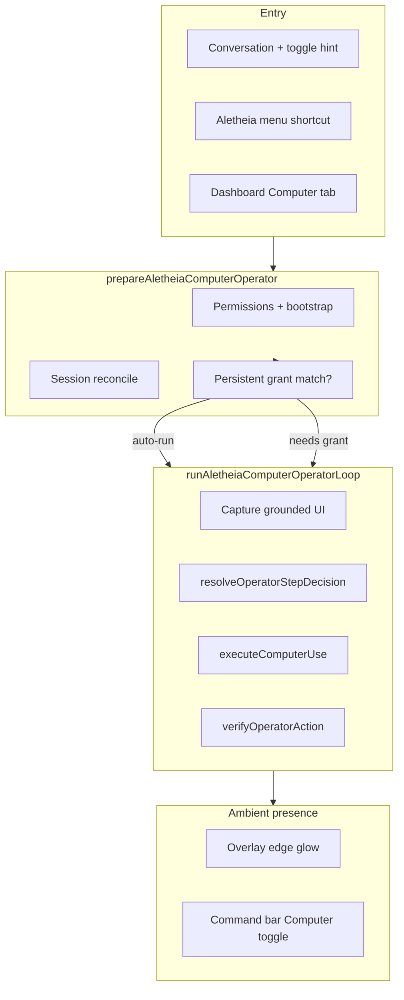

# Aletheia Computer Operator

**Status:** Shipped (loop, grants, UI, ambient presence glow)  
**Related:** `GLASS_COMPANION.md`, `aletheiaComputerOperatorRunner.ts`, `aletheiaComputerOperatorPresence.ts`

---

## One sentence

**Aletheia can operate the user's Mac on their behalf** — with explicit session grants, vision-guided step picking, live audit, persistent “Always allow” grants, and **ambient overlay glow** so the user always knows autonomous clicks are happening.

---

## Product summary

| Capability | Description |
|------------|-------------|
| **Conversation entry** | Voice or text in command bar → hybrid classifier routes to single action, observe, or operator loop |
| **Use computer toggle** | Task-scoped hint on command bar — biases classifier; auto-resets after task ends |
| **Aletheia menu shortcut** | “Use computer for this task” → activates Aletheia if needed, enables hint, focuses command bar |
| **Dashboard Computer tab** | Manual start, full audit, persistent grant revoke list |
| **Bounded sessions** | App scope, allowed actions, step budget (default 12), forbidden patterns |
| **Always allow** | SQLite persistent grants; matching tasks auto-run without grant card |
| **LLM step picker** | Claude Opus/Sonnet + screenshot + grounded UI candidates → one JSON action per step |
| **Action ledger** | Every plan/execute/verify/complete event recorded |

---

## Architecture



### Operator loop (main process)

**File:** `src/main/aletheiaComputerOperatorRunner.ts`

1. Capture screenshot + merge AX/DOM/OmniParser → `GroundedUiState`
2. `resolveOperatorStepDecision()` (LLM policy) → one action
3. Session grant + scope gate
4. `executeComputerUse()` — focus, click, type, scroll, keys, URL, read region
5. `verifyOperatorAction()` — before/after UI delta
6. Append audit, update snapshot, repeat until `done` / `pause` / budget / cancel

**Phases:** `awaiting_confirm` → `awaiting_grant` → `running` → `paused` | `complete` | `failed`

**Actions:** `focus_app`, `click_target`, `type_text`, `press_keys`, `scroll`, `read_region`, `wait_for`, `open_url`, `done`, `pause`

### LLM policy

**File:** `src/main/aletheiaComputerOperatorPolicy.ts`

- Models: `claude-opus-4-5` → `claude-sonnet-4-5`
- Strict JSON per step; confidence `< 0.4` → pause
- Invalid JSON → pause after model fallback exhausted
- Cooperative cancel at capture, planning, pre/post execution

### Session authority

**Files:** `src/shared/aletheiaComputerSessionAuthority.ts`, `src/main/aletheiaComputerGrantStore.ts`

- Per-run session grant with declaration shown in UI
- Forbidden patterns always enforced (send, delete, post, pay, close, etc.)
- Persistent grants in SQLite table `aletheia_computer_operator_grants`
- Revoke from Dashboard → Computer tab

### Conversation routing (hybrid classifier)

**Files:** `src/shared/aletheiaComputerUseClassifier.ts`, `src/main/aletheiaComputerUseClassifierHaiku.ts`, `src/main/aletheiaComputerUseRouting.ts`

| Path | Route | When |
|------|-------|------|
| **1 — Single action** | `SINGLE_ACTION` | One atomic focus/open (`Open Slack`) — `executeComputerUse(activate_app)` |
| **2 — Observe** | `OBSERVE` | Read visible state only — delegated presence (no grant) |
| **3 — Operate** | `OPERATE` | Multi-step GUI — computer operator loop (grant) |
| **Normal chat** | `NONE` | No app/computer signal |

**Stage 1 (free):** app signal + verb cluster + destructive/sequence/find overrides → ~60–70% resolved  
**Stage 2 (Haiku, 1s timeout):** `AMBIGUOUS` only → `OBSERVE` or `OPERATE` (timeout → `OPERATE`)  
**Stage 3:** `canUseDelegatedPresence()` blocks observe path when scroll/find/sequence/destructive markers present  
**Toggle prior:** `aletheiaUseComputerForNextTask` lowers threshold for computer paths; does not force operator loop. Auto-resets when the task completes, pauses, or is cancelled.

Delegated presence responses append an escalation hint for natural handoff to path 3.

### Entry surfaces

`entrySurface: "conversation" | "dashboard"` on `AletheiaComputerOperatorSnapshot`

| Surface | Grant UI | Live audit | On complete |
|---------|----------|------------|-------------|
| **conversation** | Inline in feed bubble (`computerOperatorLoopId`) | Same bubble only | TTS only (inline audit shows outcome) |
| **dashboard** | Computer tab | This tab only | Full audit remains in tab |

**One Aletheia entry point:** users talk to Aletheia in one conversation surface. The **Use computer** toggle is task-scoped (next task only), not a global mode. The Aletheia strip menu shortcut pre-enables the hint and focuses the command bar.

**One live surface per session:** `isComputerOperatorLiveUiSurface()` — only the originating `entrySurface` shows live grant/audit while active. Dashboard shows a read-only stub when the session started elsewhere; full audit archive appears there after the run finishes.

---

## Ambient presence glow (safety UX)

> **This is the most important peripheral signal.** Without it, the user has no ambient awareness that something is autonomously clicking on their machine — matching the safety pattern Claude uses in computer mode.

### Behavior spec

| Operator phase | Overlay edge glow | Command bar Computer toggle |
|----------------|-------------------|------------------------------|
| `awaiting_grant` / `awaiting_confirm` | **Off** (not operating yet) | Hint on if user enabled; not live pulse |
| `running` | **White / light-purple pulsing border** on Glass overlay window | **White / light-purple pulse** (conversation session) |
| `paused` (low confidence, ambiguity, model pause) | **Yellow / amber pulsing border** | **Amber pulse** (matches overlay) |
| `complete` / `failed` / cancelled | **Fade out** (~700ms) | Hint auto-resets; returns to normal |

### Design requirements

1. Glow sits on the **always-on-top Glass overlay window** — visible regardless of foreground app (Slack, Chrome, etc.)
2. Soft **inset + outer box-shadow** pulse around the screen edge (aligned with `overlay-glass-border` inset)
3. `pointer-events: none` — never blocks clicks
4. Fade-out transition when loop ends (not an abrupt cut)
5. Command bar **Computer** toggle pulses **white/light-purple** while running and **amber** while paused (aligned with overlay glow — not orange)

### Implementation

| Piece | Path |
|-------|------|
| Phase → glow mapping | `src/shared/aletheiaComputerOperatorPresence.ts` |
| Overlay glow component | `src/renderer/shared/OverlayComputerOperatorGlow.tsx` |
| Glow CSS + keyframes | `src/renderer/shared/overlayComputerOperatorGlow.css` |
| Wired in overlay | `src/renderer/overlay/Overlay.tsx` (main + builder-strip-only roots) |
| Use computer toggle | `src/renderer/command/CommandBar.tsx` → `command-computer-toggle` |
| Toggle CSS | `src/renderer/styles/glass.css` |
| Overlay window pin | `src/main/windows.ts` → `setOverlayPinnedForComputerOperator` |
| Menu shortcut | `src/renderer/builder/AletheiaStripMenu.tsx` → `aletheia-use-computer-shortcut` |

**Helpers:**

```ts
resolveComputerOperatorGlowPhase(phase) // "running" | "paused" | null
shouldMountComputerOperatorOverlayGlow(phase) // keep glow mounted through fade-out
isComputerOperatorStripActive(phase)     // true when running or paused
computerOperatorOverlayRootClass(phase)  // overlay-root modifier class
```

**Test IDs:**

- `data-testid="overlay-computer-operator-glow"`
- `data-glow="running" | "paused" | "exit"`
- `data-testid="aletheia-use-computer-toggle"` with `aria-pressed={true}` when hint on or operator live
- `data-testid="aletheia-strip-menu-use-computer"`

---

## UI components

| Component | Location |
|-----------|----------|
| `AletheiaComputerGrantCard` | Grant scope, goal field, Grant / Always allow |
| `AletheiaComputerLiveAudit` | Step trail, belief, Stop / Done |
| `AletheiaComputerSessionPanel` | Switches grant card ↔ live audit |
| `CommandBar` use-computer toggle | Task-scoped routing hint + live operator indicator |
| `OverlayFeedCard` | Inline grant + audit via `computerOperatorLoopId` |

---

## IPC commands

| Command | Purpose |
|---------|---------|
| `prepare-aletheia-computer-operator` | Activate, permissions, plan, grant or auto-run |
| `grant-aletheia-computer-session` | User grants session (`alwaysAllow?`, `goal?`) |
| `cancel-aletheia-computer-operator` | Stop in-progress loop |
| `dismiss-aletheia-computer-operator` | Clear terminal snapshot after complete/failed |
| `set-aletheia-use-computer-for-next-task` | Enable/disable task-scoped computer routing hint |
| `aletheia-use-computer-shortcut` | Activate Aletheia if needed, enable hint, focus command bar |
| `revoke-aletheia-computer-persistent-grant` | Remove saved always-allow grant |

---

## Prepare flow

**Function:** `prepareAletheiaComputerOperator()` in `src/main/index.ts`

Returns `{ ok: true, operator } | { ok: false, reason? }`.

1. Block if already running
2. Activate companion + bootstrap
3. Screen Recording + Accessibility permission gates
4. Reconcile existing session (preserve `loopId` on same-surface replan)
5. Match persistent grant → auto-run
6. Else → new plan + grant card

Conversational intro (`computerOperatorIntroSpeech`) is **gated on successful prepare**.

---

## File map

### Main process
- `src/main/aletheiaComputerOperatorRunner.ts` — loop orchestration
- `src/main/aletheiaComputerOperatorPolicy.ts` — LLM step picker
- `src/main/aletheiaComputerUseExecutor.ts` — macOS execution
- `src/main/aletheiaComputerGrantStore.ts` — SQLite persistent grants
- `src/main/index.ts` — IPC, prepare, conversation routing, `onComplete`

### Shared
- `src/shared/aletheiaComputerOperatorLoop.ts` — snapshot, phases, heuristic policy
- `src/shared/aletheiaComputerOperatorTypes.ts` — action kinds
- `src/shared/aletheiaComputerOperatorIntent.ts` — NL intent + intro speech
- `src/shared/aletheiaComputerOperatorPresence.ts` — glow + strip presence helpers
- `src/shared/aletheiaComputerSessionAuthority.ts` — grants, forbidden patterns
- `src/shared/aletheiaConversationPlanner.ts` — goal → bounded plan
- `src/shared/aletheiaActionVerifier.ts` — step verification

### Renderer
- `src/renderer/shared/OverlayComputerOperatorGlow.tsx`
- `src/renderer/shared/overlayComputerOperatorGlow.css`
- `src/renderer/overlay/Overlay.tsx`
- `src/renderer/builder/BuilderStrip.tsx` + CSS
- `src/renderer/builder/AletheiaComputer*.tsx`
- `src/renderer/command/CommandBar.tsx`
- `src/renderer/overlay/OverlayFeedCard.tsx`
- `src/renderer/dashboard/AletheiaDashboard.tsx` — Computer tab

### Tests
- `src/test/aletheiaComputerOperator.test.ts` — planning, grants, presence helpers
- `src/test/aletheiaComputerUseRouter.test.ts` — execution routing

---

## Demo script

1. **Glow + toggle:** Grant a session → watch purple overlay pulse + white/light-purple Computer toggle
2. **Pause:** Trigger low-confidence pause → glow and toggle shift amber
3. **Complete:** Task finishes → glow fades, toggle hint auto-resets
4. **Conversation:** Say *“Use my computer to…”* → inline grant in feed bubble
5. **Always allow:** Grant with checkbox → repeat task skips grant card

---

## Known limitations

- OS permission flow may require a second click after granting in System Settings
- Bootstrap runs on each computer-operator prepare (latency)
- Glow only visible when Glass overlay **window** is shown — main pins the overlay window while the operator is running, paused, or fading out after complete/failed
- Heuristic planner v1; complex workflows depend on LLM step quality

---

## Positioning

> Aletheia doesn't just see your screen — with your explicit grant, she operates it. Every action is bounded, auditable, revocable, and **visually signaled** at the screen edge and on the strip. Two entry paths (say it or tap COMPUTER), one trusted loop.
