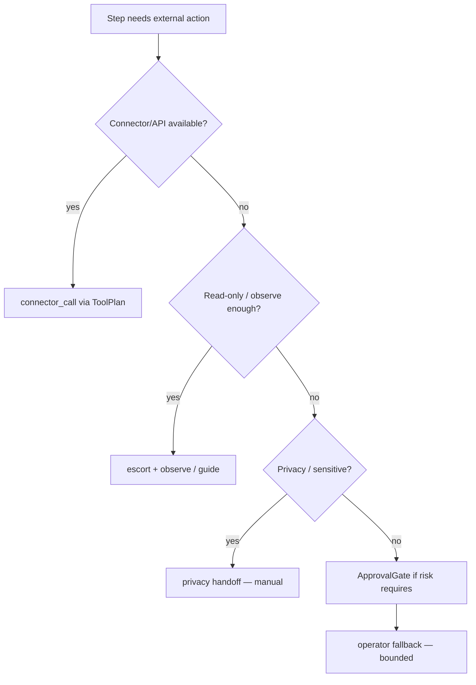

# Glass Pathways — Canonical Spec

**Status:** Phase A durable core implemented (canonical types, steps, workflow reducer, checkpoints, audit, v2 persistence + v1 migration)  
**Related:** `ALETHEIA_COMPUTER_OPERATOR.md`, `GLASS_COMPANION.md`, `glassPathwaysTypes.ts`, `glassPathwaysStore.ts`

---

> **Design principle**  
> Pathways should never rely on “the model probably remembers.”  
> They should rely on explicit state, checkpointed context, and auditable transitions.

---

## 1. North-star definition

**Glass Pathways** is not “AI makes a checklist.”

Glass Pathways is the **workflow runtime for Aletheia** that:

- turns a meaningful goal into stages and bounded steps,
- guides the user through that journey,
- crosses research, guidance, escort, privacy, and real computer actions,
- and stays **trustworthy** because it runs on explicit state, checkpoints, and audit receipts — not on “the model probably remembers.”

In other words:

> Pathways is how Aletheia runs **long-lived journeys** across apps, sessions, and modes without losing context or quietly escalating authority.

---

## 2. Product invariants (non-negotiable)

These are the rules Pathways must never violate:

1. **Guidance before automation.** Pathways always starts with guide/research/escort; operator is bounded and explicit.
2. **Explicit state over model memory.** Progress, pauses, approvals, privacy, and failures live in the schema and receipts, not in unlogged prompt text.
3. **Stage → Step hierarchy.** Stages are narrative units; steps are executable units. No “one big stage blob” that absorbs everything.
4. **Typed modes.** Each step has a `mode`: guide, research, escort, privacy, operator. Mode determines what Aletheia is allowed to do.
5. **Trust primitives.** Approval gates, privacy handoffs, checkpoints, and receipts are first-class objects, not inferred from chat.
6. **Resumability.** A pathway must survive app restart, sleep, multi-day gaps. Resuming reconstructs state from checkpoints and context, not from guessing.
7. **Routing hierarchy.** For any action: connector/API if possible → observe/guide → computer operator as fallback.
8. **No silent authority escalation.** Operator, connectors, privacy handoff, and elevated access must always be gated and visible.
9. **Aletheia relationship continuity.** The user experiences one relationship with Aletheia across Pathways, IDE, terminal, and strip; Pathways plugs into that, it doesn’t fork a new persona.

---

## 3. Runtime schema (canonical types)

All types below are **normative**. Implementation may lag; new code should converge here.

### 3.1 Top-level Pathway

```ts
type PathwayId = string;
type StageId = string;
type StepId = string;
type CheckpointId = string;
type ReceiptId = string;
type GateId = string;
type HandoffId = string;
```

```ts
interface Pathway {
  id: PathwayId;
  goal: string;
  domain: PathwayDomain;
  title: string;
  summary: string;

  status: PathwayStatus;

  currentStageId: StageId | null;
  currentStepId: StepId | null;

  stages: Stage[];

  context: PathwayContext;
  capabilities: PathwayCapabilities;

  audit: ExecutionReceipt[];
  checkpoints: Checkpoint[];

  pendingGate: ApprovalGate | null;
  pendingHandoff: PrivacyHandoff | null;

  createdAt: string;
  updatedAt: string;
  completedAt?: string;
}
```

### 3.2 Enums

```ts
type PathwayDomain =
  | "app_launch"
  | "startup"
  | "course"
  | "book"
  | "career_switch"
  | "move"
  | "wedding"
  | "custom";

type PathwayStatus =
  | "drafting"
  | "awaiting_confirmation"
  | "ready"
  | "active"
  | "paused"
  | "awaiting_input"
  | "awaiting_approval"
  | "privacy_handoff"
  | "operator_running"
  | "blocked"
  | "completed"
  | "failed"
  | "cancelled";

type StageStatus =
  | "pending"
  | "ready"
  | "active"
  | "awaiting_input"
  | "awaiting_approval"
  | "privacy_handoff"
  | "completed"
  | "blocked"
  | "skipped"
  | "failed";

type StepStatus =
  | "pending"
  | "ready"
  | "active"
  | "running_research"
  | "running_operator"
  | "awaiting_input"
  | "awaiting_approval"
  | "privacy_handoff"
  | "completed"
  | "failed"
  | "cancelled";

type StepMode =
  | "guide"
  | "research"
  | "escort"
  | "privacy"
  | "operator";

type RiskLevel =
  | "read_safe"
  | "advisory"
  | "navigational"
  | "write_requires_confirmation"
  | "sensitive_private"
  | "destructive";

type ResumeTrigger =
  | "voice_phrase"
  | "manual_resume_button"
  | "explicit_text_reply"
  | "stage_reopen";
```

### 3.3 Stage

```ts
interface Stage {
  id: StageId;
  pathwayId: PathwayId;
  index: number;

  title: string;
  objective: string;
  whyItMatters: string;

  status: StageStatus;

  inputsNeeded: string[];
  outputsRequired: string[];

  dependencies: StageDependency[];

  commonMistakes: string[];
  suggestedResources: ResourceRef[];
  suggestedTools: ToolRef[];

  completionCriteria: CompletionCriterion[];

  privacySensitivity: "low" | "medium" | "high";

  stepIds: StepId[];

  startedAt?: string;
  completedAt?: string;
}

interface StageDependency {
  kind: "stage" | "decision" | "artifact" | "credential" | "approval";
  refId: string;
  description: string;
  required: boolean;
}
```

### 3.4 Step

```ts
interface Step {
  id: StepId;
  stageId: StageId;
  index: number;

  title: string;
  description: string;

  status: StepStatus;
  mode: StepMode;
  riskLevel: RiskLevel;

  targetContext?: TargetContext;

  requiredUserInputs: RequiredInput[];

  toolPlan?: ToolPlan;
  operatorPlan?: OperatorPlan;

  outputArtifacts: ArtifactRef[];

  gatePolicy: GatePolicy;
  privacyPolicy: PrivacyPolicy;
  retryPolicy: RetryPolicy;

  lastError?: WorkflowError;

  startedAt?: string;
  completedAt?: string;
}
```

### 3.5 Context

```ts
interface PathwayContext {
  userGoal: string;
  inferredIntent?: string;

  currentNarrative: string;

  domainFacts: Record<string, unknown>;
  decisionsMade: DecisionRecord[];
  openQuestions: OpenQuestion[];

  knownCredentials: CredentialHint[];
  linkedApps: LinkedApp[];

  discoveredResources: ResourceRef[];
  artifacts: ArtifactRef[];

  notes: string[];
}

interface DecisionRecord {
  id: string;
  stageId: StageId;
  decision: string;
  rationale?: string;
  chosenOption?: string;
  alternatives?: string[];
  timestamp: string;
}
```

### 3.6 Capabilities

```ts
interface PathwayCapabilities {
  allowResearch: boolean;
  allowEscort: boolean;
  allowOperator: boolean;
  allowConnectors: boolean;
  allowVoiceResume: boolean;
  allowPrivacyHandoff: boolean;
  allowAutoAdvanceStages: boolean;

  operatorGrantMode: "per_step" | "session" | "always_allow";
}
```

### 3.7 Gates & privacy handoff

```ts
interface ApprovalGate {
  id: GateId;
  pathwayId: PathwayId;
  stageId: StageId;
  stepId: StepId;

  reason: string;
  requestedAction: ProposedAction[];
  riskLevel: RiskLevel;

  state: "pending" | "approved" | "rejected" | "expired";

  requestedAt: string;
  resolvedAt?: string;
  resolvedBy?: string;
}

interface ProposedAction {
  kind:
    | "research_query"
    | "open_site"
    | "focus_app"
    | "connector_call"
    | "computer_click"
    | "computer_type"
    | "file_write"
    | "external_submit";
  summary: string;
  scope?: string;
}
```

```ts
interface PrivacyHandoff {
  id: HandoffId;
  pathwayId: PathwayId;
  stageId: StageId;
  stepId: StepId;

  reason: string;

  suspendObservation: boolean;
  suspendActions: boolean;

  expectedUserTask: string;
  resumePhrases: string[];

  state: "pending" | "active" | "resumed" | "cancelled";

  enteredAt: string;
  resumedAt?: string;
}
```

**Privacy handoff rules:**

- Set `pathway.status = "privacy_handoff"`, `stage.status = "privacy_handoff"`, `step.status = "privacy_handoff"`.
- Pause screen capture and operator actions for this pathway session.
- Write checkpoint **before** suspension.
- Resume only via approved `ResumeTrigger` and emit receipts on enter/resume.

### 3.8 Checkpoints

```ts
interface Checkpoint {
  id: CheckpointId;
  pathwayId: PathwayId;
  stageId: StageId | null;
  stepId: StepId | null;

  statusSnapshot: {
    pathwayStatus: PathwayStatus;
    stageStatus?: StageStatus;
    stepStatus?: StepStatus;
  };

  contextSnapshot: PathwayContext;

  pendingGateId?: GateId;
  pendingHandoffId?: HandoffId;

  createdAt: string;
  reason:
    | "before_gate"
    | "before_operator_run"
    | "before_privacy_handoff"
    | "after_step_complete"
    | "manual_pause"
    | "failure_recovery";
}
```

### 3.9 Receipts

```ts
interface ExecutionReceipt {
  id: ReceiptId;
  pathwayId: PathwayId;
  stageId?: StageId;
  stepId?: StepId;

  kind:
    | "pathway_created"
    | "stage_started"
    | "stage_completed"
    | "step_started"
    | "step_completed"
    | "research_performed"
    | "resource_discovered"
    | "gate_requested"
    | "gate_approved"
    | "gate_rejected"
    | "privacy_handoff_entered"
    | "privacy_handoff_resumed"
    | "operator_started"
    | "operator_completed"
    | "checkpoint_created"
    | "pathway_paused"
    | "pathway_resumed"
    | "pathway_completed"
    | "pathway_failed";

  summary: string;
  metadata?: Record<string, unknown>;
  timestamp: string;
}
```

### 3.10 Resources & tools

```ts
interface ResourceRef {
  id: string;
  title: string;
  url: string;
  category:
    | "market_research"
    | "benchmark"
    | "tutorial"
    | "registration"
    | "pricing"
    | "compliance"
    | "distribution"
    | "community"
    | "reference";
  whyRelevant: string;
}

interface ToolRef {
  id: string;
  name: string;
  category:
    | "research"
    | "analytics"
    | "design"
    | "payments"
    | "distribution"
    | "legal"
    | "productivity"
    | "connector";
  whyRelevant: string;
  accessMode: "web" | "connector" | "desktop_app" | "local";
}
```

### 3.11 Policies & target context

```ts
interface GatePolicy {
  requiresApproval: boolean;
  approvalOnRiskLevels: RiskLevel[];
  expiresAfterMinutes?: number;
}

interface PrivacyPolicy {
  requiresPrivacyMode: boolean;
  triggerOnCredentialEntry: boolean;
  triggerOnPaymentEntry: boolean;
  triggerOnIdentityVerification: boolean;
  triggerOnSensitiveDocs: boolean;
}

interface RetryPolicy {
  maxRetries: number;
  backoffMs: number;
  failTo: "awaiting_input" | "blocked" | "failed";
}

interface TargetContext {
  appName?: string;
  siteUrl?: string;
  pageHint?: string;
  targetEntity?: string;
}
```

### 3.12 Supporting types (normative stubs)

Agents implementing runners should treat these as first-class; fields may grow incrementally.

```ts
interface CompletionCriterion {
  id: string;
  description: string;
  required: boolean;
}

interface RequiredInput {
  id: string;
  label: string;
  kind: "text" | "choice" | "file" | "credential_hint" | "confirmation";
  options?: string[];
  required: boolean;
}

interface ToolPlan {
  connectorId?: string;
  agentId?: string;
  readOnly: boolean;
  actionSummary: string;
}

interface OperatorPlan {
  goal: string;
  scopeLines: string[];
  maxSteps?: number;
  forbiddenPatterns?: string[];
}

interface ArtifactRef {
  id: string;
  title: string;
  kind: "note" | "file" | "link" | "decision" | "screenshot_ref";
  ref?: string;
  createdAt: string;
}

interface OpenQuestion {
  id: string;
  stageId?: StageId;
  question: string;
  blocking: boolean;
  createdAt: string;
}

interface CredentialHint {
  id: string;
  service: string;
  scope: string;
  /** Never store secrets — location/label only. */
  label: string;
}

interface LinkedApp {
  id: string;
  name: string;
  bundleId?: string;
  lastFocusedAt?: string;
}

interface WorkflowError {
  code: string;
  message: string;
  recoverable: boolean;
  stageId?: StageId;
  stepId?: StepId;
}
```

---

## 4. Workflow engine (events & transitions)

### 4.1 Events

```ts
type WorkflowEvent =
  | { type: "PATHWAY_CREATE_REQUESTED"; goal: string; domain?: PathwayDomain }
  | { type: "PATHWAY_CONFIRMED"; pathwayId: PathwayId }
  | { type: "STAGE_START"; pathwayId: PathwayId; stageId: StageId }
  | { type: "STEP_START"; pathwayId: PathwayId; stageId: StageId; stepId: StepId }
  | { type: "RESOURCE_DISCOVERED"; pathwayId: PathwayId; stageId: StageId; resource: ResourceRef }
  | { type: "APPROVAL_REQUESTED"; gate: ApprovalGate }
  | { type: "APPROVAL_RESOLVED"; gateId: GateId; resolution: "approved" | "rejected" }
  | { type: "PRIVACY_HANDOFF_ENTER"; handoff: PrivacyHandoff }
  | { type: "PRIVACY_HANDOFF_RESUME"; handoffId: HandoffId; trigger: ResumeTrigger }
  | { type: "OPERATOR_RUN_REQUESTED"; pathwayId: PathwayId; stepId: StepId }
  | { type: "OPERATOR_RUN_COMPLETED"; pathwayId: PathwayId; stepId: StepId }
  | { type: "CHECKPOINT_CREATE"; checkpoint: Checkpoint }
  | { type: "PATHWAY_PAUSE"; pathwayId: PathwayId }
  | { type: "PATHWAY_RESUME"; pathwayId: PathwayId }
  | { type: "PATHWAY_COMPLETE"; pathwayId: PathwayId }
  | { type: "PATHWAY_FAIL"; pathwayId: PathwayId; error: WorkflowError };
```

**Reducer contract:** `(state: Pathway, event: WorkflowEvent) => Pathway` plus side-effect descriptors (IPC, operator prepare, privacy suspend). UI and store must dispatch events — not mutate status fields ad hoc.

### 4.2 Allowed transitions

High-level state flows:

| From | To |
|------|-----|
| `drafting` | `awaiting_confirmation` |
| `awaiting_confirmation` | `ready` |
| `ready` | `active` |
| `active` | `awaiting_input` |
| `active` | `awaiting_approval` |
| `active` | `privacy_handoff` |
| `active` | `operator_running` |
| `operator_running` | `active` |
| `privacy_handoff` | `active` |
| `awaiting_approval` | `active` |
| `active` | `paused` |
| `paused` | `active` |
| `active` | `completed` |
| `active` | `blocked` |
| `any` | `failed` |
| `any` | `cancelled` |

Implement as a reducer/state machine with guards, not ad-hoc mutations.

### 4.3 Trigger phrases → events

Map user utterances directly to workflow events instead of treating them as generic chat:

| Phrase | Event / behavior |
|--------|------------------|
| “Take me there” | Create escort step & `STEP_START` with `mode = "escort"` |
| “Continue for me” | `APPROVAL_REQUESTED` then, if approved, `OPERATOR_RUN_REQUESTED` and `operator_running` |
| “Go into privacy mode” | `PRIVACY_HANDOFF_ENTER` |
| “I’m ready” / “Come back” | `PRIVACY_HANDOFF_RESUME` |
| “Pause this” | `PATHWAY_PAUSE` |
| “What’s next?” | No state change — query `currentStageId` / `currentStepId` and respond |

Voice and command-bar classifiers should resolve to these events when a pathway session is active.

---

## 5. Routing hierarchy

For any step that may touch the outside world, resolve in order:



**Integrations (existing Glass subsystems):**

| Layer | Glass subsystem |
|-------|-----------------|
| Connectors / API | `glassPathwaysConnectors.ts`, MCP/oauth (incremental) |
| Escort / observe | Escort launch IPC, companion delegated presence, screen context |
| Operator | `prepareAletheiaComputerOperator`, existing grant card & audit |
| Privacy | Companion privacy mode + pathway `pendingHandoff` |

Operator is **always** fallback when connector and observe are insufficient — never the default path.

---

## 6. Minimal persistence (Phase 1–2)

For the first engine slice, persist:

- `Pathway` record,
- all `Stage` and `Step` states,
- `checkpoints`,
- `pendingGate`,
- `pendingHandoff`,
- `audit` receipts,
- last `PathwayContext` snapshot.

That is enough to survive restart and keep Aletheia’s relationship with the journey continuous.

**Storage:** renderer `localStorage` key `glass:pathways:v1` today; converge store shape to this schema. Main process may mirror for IPC generation — single source of truth should be the canonical `Pathway` object.

---

## 7. Phase plan (runtime-first, surface-aligned)

Phases respect both UX and engine. **Do not skip Phase A** to add more UI polish on the stage-only slice.

### Phase A — Durable core

- Implement `Pathway`, `Stage`, `Step`, status enums in `glassPathwaysTypes.ts`.
- Implement workflow reducer and `WorkflowEvent` dispatch.
- Implement `PathwayContext` and real `Checkpoint` snapshots (not receipt-only).
- Implement `ExecutionReceipt` audit log.
- Wire minimal Spaces/Pathways UI: goal → stages → steps; **no automation yet**.

### Phase B — Trust surfaces

- Implement `ApprovalGate`, `GatePolicy`, operator grants anchored in existing authority model (`ALETHEIA_COMPUTER_OPERATOR.md`).
- Implement `PrivacyHandoff`, `PrivacyPolicy`, checkpoint-before-suspension.
- Expose visible approval cards and privacy cards in Pathways UI.
- Integrate with Aletheia mic/screen/privacy indicators so authority and pathway state never conflict.

### Phase C — Modes & routing

- Implement `StepMode` and `RiskLevel` runners: guide, research, escort, privacy, operator.
- Enforce routing hierarchy with existing Glass subsystems (connectors → observe → operator).
- Replace transient `PathwayLiveSession` with step-scoped mode state on `Step`.

### Phase D — UX deepening

- Richer stage/step surfaces, substeps, “I’m stuck”, “Explain this more”.
- Better generation for stages **and** steps.
- Step-level progress and completion views.
- “Continue where I left off” from checkpoints & context.

### Later phases

- `allowAutoAdvanceStages`, research receipts, richer artifacts, resource discovery flows, domain-specific templates — after foundation is solid.

---

## 8. Spaces shell (product surface)

Pathways lives under **Spaces** on the builder strip:

| Surface | Behavior |
|---------|----------|
| Strip launcher | Compact popover over Spaces tab — mode cards only (e.g. Glass Pathways). |
| Full-screen workspace | `GlassSpacesWorkspace` — chrome (title, saved pathways, theme, exit) + Pathways UI. |
| Entry | Strip → launcher → click mode → full screen. Spaces tab does not open full pathways editor inline. |

Spaces is the parent; Pathways is the primary mode. Future modes (e.g. escort-only, privacy studio) register on `SPACES_MODES`.

---

## 9. Implementation map (current → canonical)

Use this when migrating. **Canonical spec wins** on conflict.

| Canonical | Current (V1 slice) | Notes |
|-----------|-------------------|--------|
| `Pathway` + `Stage` + `Step` | `GlassPathway` + `GlassPathwayStage` only | Steps absorbed into `userActions` / substeps |
| `PathwayStatus` (13 values) | 5 values | Missing approval, privacy_handoff, operator_running, etc. |
| `PathwayContext` | — | Context rebuilt from prompts at ask time |
| `Checkpoint` + snapshot | `addPathwayCheckpoint` → receipt | Not restorable |
| `ExecutionReceipt` | `PathwayRuntimeReceipt` | Smaller kind set; on pathway not `audit` |
| `ApprovalGate` | Operator grant card only | Not pathway-scoped |
| `PrivacyHandoff` | Heuristic + companion privacy + live session | Not persisted object |
| `WorkflowEvent` reducer | Direct store mutations | `glassPathwaysStore.ts` |
| `StepMode` on `Step` | `PathwayLiveSessionMode` transient | escort/privacy/execution/connector/observe |
| Routing hierarchy | `glassPathwaysActionRouting.ts` | **Aligned** |
| Generation | `glassPathwaysPrompts.ts`, IPC generate | Stages only in payload |

**Key files:**

| Area | Path |
|------|------|
| Types (migrate here) | `src/shared/glassPathwaysTypes.ts` |
| Store / persistence | `src/renderer/builder/glassPathwaysStore.ts` |
| Workflow engine (to add) | `src/shared/glassPathwaysWorkflow.ts` (proposed) |
| Routing | `src/shared/glassPathwaysActionRouting.ts` |
| Escort / privacy heuristics | `src/shared/glassPathwaysEscort.ts` |
| Execution | `src/shared/glassPathwaysExecution.ts` |
| Receipts (merge into audit) | `src/shared/glassPathwaysRuntime.ts` |
| UI | `src/renderer/builder/GlassPathwaysView.tsx`, panels |
| Spaces shell | `src/renderer/builder/GlassSpacesWorkspace.tsx`, `SpacesPanel.tsx` |
| Tests | `src/test/glassPathways.test.ts` |

---

## 10. Agent instructions

When implementing Pathways work:

1. Read this file first; do not invent parallel type systems.
2. Prefer **event → reducer → receipt** over UI-local state patches.
3. Never store credentials or secrets in `PathwayContext`.
4. Operator must go through existing computer-operator grants — no parallel trust UI.
5. Every transition that changes authority or privacy must emit an `ExecutionReceipt`.
6. Checkpoints before privacy handoff and before operator runs are **required**, not optional.
7. Add tests in `glassPathways.test.ts` for reducer transitions and persistence round-trips.

---

*Last updated: canonical spec established from original Perplexity schema + Glass/Aletheia architecture alignment.*
