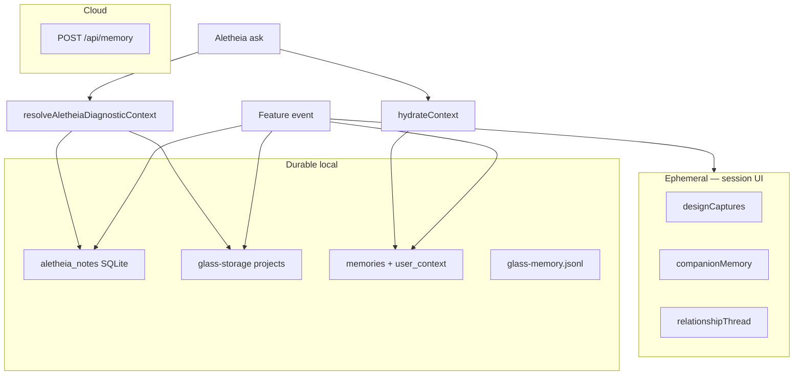

# Glass / Aletheia Memory Architecture

> **Source of truth for how Glass remembers, where data lives, and how features must integrate.**

Product principle:

- **Notes** remember *that* something happened.
- **Projects** remember *what* was saved.
- **Glass Memory** (vector + `user_context`) remembers *what is worth recalling long term*.
- **IDs** connect the layers.
- Aletheia retrieves the right layer at the right time.

Canonical typed inventory: [`src/shared/memory/memoryLayerAudit.ts`](../../src/shared/memory/memoryLayerAudit.ts) (`MEMORY_LAYER_AUDIT_ROWS`).

Feature routing contracts: [`src/shared/memory/memoryFeatureRegistry.ts`](../../src/shared/memory/memoryFeatureRegistry.ts).

---

## Layer overview



---

## Retention summary

| Layer | Restart | Cross-chat | Pruning |
|-------|---------|------------|---------|
| Vector `memories` | Yes | Yes | 90d low-importance (`pruneStaleMemories`) |
| `user_context` | Yes | Yes | Manual / admin |
| `aletheia_notes` | Yes | Yes | No auto prune |
| Glass Storage Projects | Yes | Yes | Manual |
| `designCaptures` | **No** | No | Feed delete / restart |
| Companion memory | No | No | 30s TTL |
| Relationship thread | No | No | 45min window |
| Session history | Yes | Yes | `pruneHistory` 90/30/7d tiers |
| `glass-memory.jsonl` | Yes | Yes | Unbounded |
| Wingman `wingman-sessions.jsonl` | Yes | Yes | Manual file delete |
| Listen `glass-sessions.json` | Yes | Per session | Session store prune |

Boot pruning: [`sessionHistoryStore.pruneHistory`](../../src/main/sessionHistoryStore.ts) + [`glassMemoryEngine.pruneStaleMemories`](../../src/main/glassMemoryEngine.ts).

---

## ID linking strategy

| ID | Created by | Stable? | Cross-links |
|----|------------|---------|-------------|
| `feedItemId` / capture id | Design capture feed | Per capture | → `designCaptures`, default `projectId` |
| `projectId` | `saveDesignToCodeProject` | Yes on disk | → `linkedProjectId` on notes, index |
| `noteId` | `appendAletheiaNote` | Yes SQLite | → `linkedProjectId`, `sessionId` |
| `sessionId` | Aletheia companion session | Yes SQLite | Notes, observation snapshots |
| Memory tags | D2C ingestion | Episodic rows | `d2c:*` tags for dedupe |

`MemoryCrossLinks` type: [`memoryLayerAudit.ts`](../../src/shared/memory/memoryLayerAudit.ts).

**Persisted recall pointer:** `glass-settings.json` → `latestDesignToCodeProjectId` (restored at boot).

---

## Design to Code routing

| Event | Aletheia note | Project save | Semantic memory | Ephemeral capture |
|-------|---------------|--------------|-----------------|-----------------|
| Generation failed | Always + `linkedProjectId` | No | Pattern if ≥2 failures | Yes |
| Save succeeded | Always + `linkedProjectId` | Yes | Preference/pattern rules | Patch save status |
| Save failed | Always + `linkedProjectId` | Partial index | Pattern if ≥2 save fails | Patch save status |
| Explicit “remember … design to code” | Optional | — | Episodic always | — |

Implementation: [`noteDesignToCodeForAletheia`](../../src/main/index.ts), [`designToCodeMemoryIngestion.ts`](../../src/shared/design/designToCodeMemoryIngestion.ts).

**Do not** embed every D2C run into vector memory by default.

---

## Recall paths (Aletheia asks)

1. **`resolveAletheiaDiagnosticContext`** — D2C notes (diagnostic/recall prompts, **no companion required**), project metadata recall, live 24h capture summary.
2. **`enrichGlassAskRequestWithMemory` / `hydrateContext`** — Semantic episodic + all `user_context` (companion-independent).
3. **Companion-only** — Display awareness, persona directive, general Aletheia note keyword selection (non-diagnostic).

Diagnostic prompts: “what happened?”, “what did you save?”, “where is it?”, etc. — see [`designToCodeProjectRecall.ts`](../../src/shared/design/designToCodeProjectRecall.ts).

Project metadata resolver (index only, no code load): [`glassStorageProjectRecall.ts`](../../src/shared/memory/glassStorageProjectRecall.ts) — lives in `shared/memory` so pure recall formatters avoid main-process imports.

**Agent output vs Glass Storage:** Research/Writing agents persist markdown to the configured agent output folder (`agentOutputFolder`); Design to Code uses Glass Storage Projects (`projects-index.json`). Registry `emitsProjects` covers both artifact styles.

---

## Integrating a new feature

1. Register a `MemoryRoutingContract` in [`memoryFeatureRegistry.ts`](../../src/shared/memory/memoryFeatureRegistry.ts).
2. Choose layers:
   - Ephemeral UI state → in-memory `GlassState` only if acceptable to lose on restart.
   - Operational events → `captureAletheiaSessionNote` with `linkedProjectId` when artifacts exist.
   - Artifacts → filesystem + index (like Projects), not every ask payload.
   - Long-term patterns → `storeMemory` / `upsertUserContext` with selective rules (not every event).
3. Add cross-links (`sessionId`, `projectId`, `captureId`) on notes — do not duplicate full payloads in SQLite notes.
4. Wire recall via `resolveAletheiaDiagnosticContext` or feature-specific prompt gates.
5. Add row to `MEMORY_LAYER_AUDIT_ROWS` and this doc.
6. Add tests + run `node scripts/glass-memory-audit.mjs`.

---

## Diagnostics

```bash
node scripts/glass-memory-audit.mjs
node scripts/glass-memory-audit.mjs --json
node scripts/debug-memory-retrieval.mjs --query "design to code preferences"
```

Tests: `designToCodeSessionStore.test.ts`, `resolveAletheiaDiagnosticContext.test.ts`, `glassStorageProjectRecall.test.ts`, `glassMemoryRestartRecall.test.ts`, `designToCodeProjectRecall.test.ts`, `designToCodeMemoryIngestion.test.ts`.

---

## Known limitations (intentional)

- `designCaptures` not persisted — use notes + Projects after restart.
- Cloud memory vault has no Glass read path.
- Legacy `glass-memory.jsonl` parallels vector memory (not merged in this architecture).
- Research/Writing sessions live in renderer `localStorage` — not in main-process Aletheia recall.
- Relationship thread is ephemeral companion UX, not durable memory.

---

## Related docs

- [DESIGN_TO_CODE.md](./DESIGN_TO_CODE.md) — pipeline + memory routing section
- [GLASS_ARCHITECTURE.md](./GLASS_ARCHITECTURE.md) — pyramid / tiers
